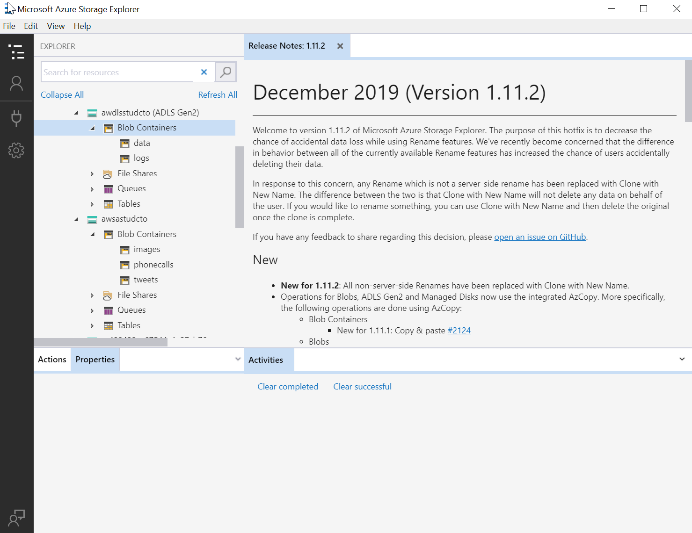

---
lab:
    title: '使用数据存储'
    module: '模块 2:使用数据存储'
---

# DP 200 - 实施数据平台解决方案
# 实验室 2  - 使用数据存储

**预计用时**：60 分钟

**先决条件**：假设已阅读了本实验室的案例研究。假设模块 1 的内容和实验室：数据工程师的 Azure 也已完成

**实验室文件**：本实验室文件位于 _Allfiles\Labfiles\Starter\DP-200.2_ 文件夹。

## 实验室概述

在本实验室中，学生将能够根据给定的一组业务和技术要求确定要实现的适当存储类型。他们将能够创建 Azure 存储帐户和 Data Lake Storage 帐户，并解释 Data Lake Storage 版本 1 和版本 2 之间的区别。他们还将能够演示如何将数据加载到所选的数据存储中。

## 实验室目标
  
完成本实验室课程后，你将能够：

1. 在 Azure 中选择数据存储方法
1. 创建 Azure 存储帐户
1. 解释 Azure Data Lake Storage
1. 将数据上传到 Azure Data Lake

## 场景
  
你已被聘为高级数据工程师，负责在数字转换项目中实施技术解决方案。这个组织正在将托管公司网站的 Internet 信息服务 (IIS) 迁移到 Azure。开发人员正在将 Web 应用程序及其逻辑传输到 Azure Web 应用，并且他们已经要求你为他们准备可用于托管网站上使用的静态图像的数据存储。

此外，信息服务部门已告知你：他们的团队正在壮大，很快就会有数据科学家加入，后者将开始构建预测分析解决方案。已经要求你设置一个解决方案，用于托管他们工作的生产环境。在第一个实例中，你将评估为解决方案创建的适当存储层。

在此工作结束时，你将能够：

1. 在 Azure 中选择数据存储方法
2. 创建 Azure 存储帐户
3. 解释 Azure Data Lake Storage
4. 将数据上传到 Azure Data Lake

> **重要事项**：在完成本实验室时，请记下你在任何预配或配置任务中遇到的任何问题，并将其记录在位于 _\Labfiles\DP-200-Issues-Doc.docx_ 的文档的表格中。记录实验室编号，记录技术，描述问题以及曾经的解决方案。保存该文档，以便在稍后的模块中再次参考。

## 练习 1：在 Azure 中选择数据存储方法

预计用时：15 分钟

个人练习
  
本练习的主要任务如下：

1. 从案例研究中，确定针对网站静态图像和预测分析解决方案的数据存储要求。

1. 讲师将与小组讨论结果。

### 任务 1：确定 AdventureWorks 的数据存储要求和结构。

1. 从实验室虚拟机中，启动 **Microsoft Word**，然后从 **Allfiles\Labfiles\Starter\DP-200.2** 文件夹中打开文件 **DP-200-Lab02-Ex01.docx**。

1. 花 **10 分钟** 记录本实验室场景中概述的数据存储要求。你还可以使用案例研究文档作为其他参考。

### 任务 2：与讲师讨论发现

1. 讲师会让小组停下来讨论结果。

> **结果**：完成本练习后，你已创建一个 Microsoft Word 文档，其中显示两个数据存储要求表。

## 练习 2：创建 Azure 存储帐户
  
预计用时：20 分钟

个人练习
  
本练习的主要任务如下：

1. 在距离实验室位置最近的区域创建名为 **awrgstudxx** 的 Azure 资源组，其中 **xx** 是你的姓名首字母缩写。

1. 在资源组 awrgstudxx 中，在距离实验室位置最近的区域创建并配置名为 **awsastudxx** 的存储帐户，其中 **xx** 是你的姓名缩写。

1. 在 awsastudxx 存储帐户中创建名为 **images**、 **phonecalls** 和 **tweets** 的容器。

1. 将一些图形上传到存储帐户的图片容器中。

### 任务 1：创建和配置资源组。

1. 从实验室虚拟机上启动 Microsoft Edge，浏览 Azure 门户 [**http://portal.azure.com**](http://portal.azure.com) 并使用已分配给你的课程帐户登录。

1. 在 Azure 门户中，单击 **“资源组”** 图标。

1. 在 **“资源组”** 屏幕中，单击 **“+ 添加”** 使用以下设置创建第一个资源组：

    - **订阅**：你在本实验室使用的订阅名称
    
    - **资源组名称**： **awrgstudxx**，其中 **xx** 是你的首字母缩写。

    - **资源组位置**：最靠近实验室位置的 Azure 区域名称，在其中你能预配 Azure VM 的位置。

      > **注意**：要确定订阅中可用的 Azure 地区，请参考 [**https://azure.microsoft.com/zh-cn/regions/offers/**](https://azure.microsoft.com/zh-cn/regions/offers/)

        

1. 在“创建资源组”屏幕中，单击 **“审阅 + 创建”**。

1. 在“创建资源组”屏幕中，单击 **“创建”**。

> **注意**：创建资源组大约需要 30 秒。你可通过检查通知区域以了解创建完成的时间。

### 任务 2：创建和配置存储帐户。

1. 在屏幕左上方的 Azure 门户中，单击 **“主页”** 超链接

1. 在 Azure 门户中，单击 **“+ 创建资源”** 图标。

1. 在“新”屏幕中，点击 **“搜索市场”** 文本框，然后输入词汇 **存储帐户**。在显示的列表中单击 **“存储帐户 - blob、文件、表、队列”**。

1. 在 **“存储帐户”** 屏幕中，点击 **“创建”**。

1. 从 **“创建存储帐户”** 屏幕，使用以下设置创建第一个存储帐户：

    - 在项目详细信息下，指定以下设置：

        - **订阅**：你在本实验室使用的订阅名称
    
        - **资源组**： **awrgstudxx**，其中 **xx** 是你的首字母缩写。

    - 在实例详细信息下，指定以下设置：
    
        - **“存储帐户名称”**： **awsastudxx**，其中 **xx** 是你的姓名缩写。

        - **位置**：最靠近实验室位置的 Azure 区域名称，在其中你能预配 Azure VM。

        - **性能**： **标准**。

        - **帐户类型**： **StorageV2（通用 v2）**。

        - **复制**： **读取访问权限异地冗余存储 (RA_GRS)**

        - **访问层（默认）**： **热**。

            

1. 在 **“创建存储帐户”** 屏幕中，单击 **“审查+创建”**。

1. 验证 **“创建存储帐户”** 屏幕后，单击 **“创建”**。

   > **注意**：创建存储帐户大约需要 90 秒，同时根据你定义的设置进行磁盘配置和磁盘设置。

### 任务 3：在存储帐户中创建和配置容器。

1. 在 Azure 门户中，消息显示_你的部署已完成_，单击 **“转到资源”** 按钮。

1. 在 **awsastudxx** 屏幕中（其中 **xx** 是你的姓名缩写），在 **“Blob 服务”** 下，单击 **“容器”**。

1. 在 **“awsastudxx - 容器”** 屏幕中，在左上角单击 **“+ 容器”** 按钮。

1. 在 **“新建容器”**屏幕中，使用以下设置创建容器：

    - 名称： **图像**。

    - 公共访问级别： **专用（无匿名访问）**

        

1. 在 **“新建容器”** 屏幕中，单击 **“确定”**。

   > **注意**：容器会立即创建，并将显示在 **“awrgstudxx - Containers”** 屏幕的列表中。

1. 重复步骤 4 -5 以创建名为 **phonecalls**、公共访问级别为 **“专用(不允许匿名访问)”** 的容器

1. 重复步骤 4 -5 以创建名为 **“tweets”** 的容器，公共访问级别为 **“专用(无匿名访问)”**。你的屏幕应如下图所示：

    

### 任务 4：将一些图形上传到存储帐户的图片容器中。

1. 在 Azure 门户中，在 **“awsastudxx - 容器”** 屏幕中，单击列表中的 **“图片”** 项目。

1. 在 **“图片”** 屏幕中，点击 **“上传”** 按钮。

1. 在 **“上传 blob”** 屏幕的“文件”文本框中，单击文本框右侧的 **“文件夹”** 图标。

1. 在 **“打开”** 对话框中，浏览到 **“Labfiles\Starter\DP-200.2\website graphics”** 文件夹。突出显示以下文件：

    - one.png

    - two.png

    - three.png

    - No.png

1. 在 **“打开”** 对话框中，单击 **“打开”**。 

1. 在 **“上载blob”** 屏幕中，单击 **“上载”** 按钮。

1. 关闭 **“上传 blob”** 屏幕，并关闭 **“图片”** 屏幕。

1. 关闭 **“awsastudxx - 容器”** 屏幕，并在 Azure 门户中，导航到 **“主”** 屏幕。 

   > **注意**：文件上传将需要大约 5 秒钟。完成后，它们将出现在上传 blob 屏幕的列表中。

> **结果**：完成本练习后，你已创建一个名为 awsastudxx 的存储帐户，该帐户具有一个名为“图片”的容器，其中包含四个可以在 AdventureWorks 网站上使用的图形文件。

## 练习 3：解释 Azure Data Lake Storage
  
预计用时：15 分钟

个人练习
  
本练习的主要任务如下：

1. 在最靠近实验位置的区域，在资源组 awrgstudxx 中创建名为 **awdlsstudxx** 的存储帐户，并将其配置为 Data Lake Store Gen2 存储类型，其中 **xx** 是你姓名的首缩写。

1. 在 awdlsstudxx 存储帐户中创建名为 **“logs”** 和 **“data”** 的容器。

1. 将一些数据文件上传到存储帐户的数据容器中。

### 任务 1：创建存储帐户并将其配置为 Data Lake Store Gen II 存储。

1. 在 Azure 门户中，点击 **+ 创建资源** 按钮。

1. 在“新”屏幕中，单击 **“搜索市场”** 文本框，然后输入 **“存储”**。在出现的列表中单击 **存储帐户**。

1. 在 **“存储帐户”** 边栏选项卡上，单击 **“创建”**。

1. 从 **“创建存储帐户”** 边栏选项卡，使用以下设置创建存储帐户：

    - 在项目详细信息下，指定以下设置：

        - **订阅**：你在本实验室使用的订阅名称
    
        - **“资源组名称”**： **awrgstudxx**，其中 **xx** 是你的首字母缩写。

    - 在实例详细信息下，指定以下设置：

        - **“存储帐户名称”**： **awdlsstudxx**，其中 **xx** 是你的姓名缩写。

        - **“位置”**：最靠近实验室位置的 Azure 区域名称，在其中你能预配 Azure VM。

        - **性能**： **“标准”**。

        - **“帐户类型”**： **“StorageV2（通用 v2）”**。

        - **复制**： **读取访问权限异地冗余存储 (RA_GRS)**

        - **访问层（默认）**： **“热”**。

1. 单击 **“高级”** 选项卡。

1. 在 Data Lake Storage Gen2 下，单击 **“分层命名空间”** 下的 **“启用”**。

    

1. 在 **“创建存储帐户”** 边栏选项卡中，单击 **“审查 + 创建”**。

1. 验证 **创建存储帐户*** 边栏选项卡后，单击 **“创建”**。

   > **注意**：创建存储帐户大约需要 90 秒，同时会根据你定义的设置预配磁盘和磁盘配置。

### 任务 2：在存储帐户中创建和配置容器。

1. 在 Azure 门户中，消息显示“你的部署已完成”__，单击 **“转到资源”** 按钮。

1. 在 **awdlsstudxx** 屏幕中（其中 **xx** 是你的姓名缩写），单击 **“容器”**。

1. 在 **“awrgstudxx - 容器”** 屏幕中，在左上角单击 **“+ 容器”** 按钮。

1. 从 **“新建”** 屏幕中，使用以下名称创建文件系统：

    - 名称： **数据**。

    - 名称： **日志**

1. 在 **“新容器”** 屏幕中，单击 **“确定”**。

   > **注意**：会立即创建文件系统，并将出现在如下所示的 **“awdlsstudxx - 容器”** 屏幕列表中。

    

> **结果**：完成本练习后，你已创建名为 awdlsstudxx 的 Data Lake Gen2 的存储帐户，该帐户拥有名为“数据”的文件系统。

## 练习 4：将数据上传到 Azure Data Lake。
  
预计用时：10 分钟

个人练习
  
本练习的主要任务如下：

1. 安装并启动 Microsoft Azure 存储资源管理器

1. 将一些数据文件上传到 Data Lake Gen II 存储帐户的数据容器。

### 任务 1：安装存储资源管理器。

1. 在 Azure 门户中，在 **“awdlsstudxx - 容器”** 屏幕中，单击列表中的 **“数据”** 项目。

1. 出现一个屏幕，说明 Azure Data Lake Storage Gen2 现在可在存储资源管理器中使用，单击 **“下载 Azure 存储资源管理器”** 超链接。

1. 你将进入以下“Azure 存储资源管理器”网页，其中有个显示 **“立即下载”** 的按钮。单击该按钮。

1. 在 Microsoft Edge 对话框中，单击 **“保存”**，下载完成后，点击 **“查看下载”**，在 Microsoft Edge 的下载屏幕中，单击 **“打开文件夹”**。这将打开“Downloads”文件夹。

1. 双击文件 **“StorageExplorer.exe”**，在“用户帐户控制”对话框中单击 **“是”**。

1. 在“许可协议”屏幕中，选择 **“我同意协议”** 旁边的单选按钮，然后单击 **“安装”**。

   > **注意**：存储资源管理器的安装大约需要 4 分钟。借助 Azure 存储资源管理器，你可使用 Azure 存储资源管理器轻松管理存储帐户的内容。上传、下载和管理 blob、文件、队列、表和 Cosmos DB 实体。它还使你能够轻松访问，以管理虚拟机磁盘。

1. 安装完成后，确保选中 **启动 Microsoft Azure 存储** 旁边的复选框，然后单击 **完成**。Microsoft Azure 存储资源管理器打开并列出你的订阅。

1. 在存储资源管理器中，选择 **“管理帐户”**，然后转到 **“帐户管理面板”**。

1. 左侧窗格现显示你已登录的所有 Azure 帐户。要连接到其他帐户，请选择 **“添加帐户”**

1. 想要登录国家云或 Azure Stack，请单击 Azure 环境下拉列表，选择要使用的 Azure 云。选择环境后，单击 **“登录...”** 按钮。

1. 成功登录 Azure 帐户后，该帐户和与该帐户关联的 Azure 订阅将添加到左窗格中。选择要使用的 Azure 订阅，然后选择 **“应用”**。左窗格显示与所选 Azure 订阅关联的存储帐户。

    

### 任务 2：将数据文件上传到 Data Lake Gen II 存储帐户的数据容器。

1. 在 Azure 存储资源管理器中，单击箭头以展开你的订阅。

1. 在 **“存储帐户”** 下，搜索存储帐户 **“awdlsstudxx (ADLS Gen2)”**，然后单击箭头将其展开。

1. 在 **“Blob 容器”** 下，单击箭头将其展开并显示 **“日志”** 文件系统。单击 **“日志”** 文件系统。

1. 在 Azure 存储资源管理器中，单击 **“上传”** 图标旁边的箭头，然后单击 **“上传文件....”**。

1. 在“上传文件”对话框中，单击 **“选定的文件”** 文本框旁边的省略号。

1. 在 **“选择待上传的文件”** 对话框中，浏览到 **“Labfiles\Starter\DP-200.2\logs”** 文件夹。突出显示以下文件：

    - weblogsQ1.log

    - weblogsQ2.log

    - preferences.json

1. 在 **“选择要上传的文件”** 对话框中，选择 **“打开”**。

1. 在 **“上传文件”** 屏幕中，单击 **“上传”** 按钮。

   

1. 在 **Blob 容器** 下，单击箭头以将其展开并显示 **数据** 文件系统。单击 **“数据”** 文件系统。

1. 在 Azure 存储资源管理器中，单击 **“上传”** 图标旁边的箭头，然后单击 **“上传文件…”**。

1. 在“上传文件”对话框中，单击 **“选定的文件”** 文本框旁边的省略号。

1. 在 **“选择待上传的文件”** 对话框中，浏览到 **“Labfiles\Starter\DP-200.2\Static Files”** 文件夹。突出显示以下文件：

    - DimDate2.txt

1. 在 **“选择待上传的文件”** 对话框中，单击 **“打开”**。

1. 在 **“上传文件”** 屏幕中，单击 **“上传”** 按钮。

1. 重复上述步骤，将 preferences.JSON 文件从 **Labfiles\Starter\DP-200.2\logs** 文件夹上传到 Data Lake Store gen2 中的 **数据** 文件系统

   > **注意**：文件上传将需要大约 5 秒钟。你将在 Azure 存储资源管理器中看到一条消息，说明 **你的视图可能缺少数据。需要刷新吗？单击“是”**。完成后，两个文件都将显示在上传 blob 屏幕的列表中。

    

1. 在 Azure 存储资源管理器的数据文件系统中，单击 **“+ 新建文件夹”** 按钮。

1. 在“新建文件夹”屏幕的“新文件夹名称”文本框中，键入 **“输出”**。

1. 关闭 Azure 存储资源管理器。

1. 返回 Azure 门户，然后导航到 **主页** 边栏选项卡。

> **结果**：完成本练习后，你已创建名为 awdlsstudxx 的 Data Lake Gen II 存储帐户，该帐户具有名为“数据”的文件系统，其中包含两个可供 AdventureWorks 数据科学家使用的网络日志文件。
