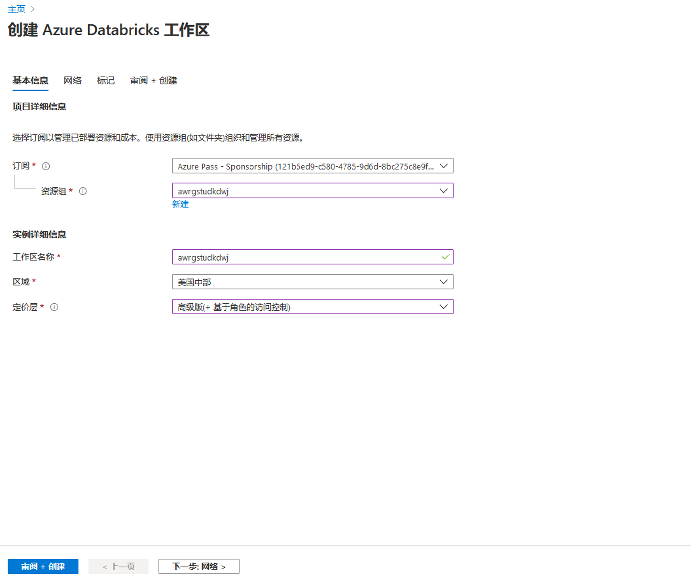
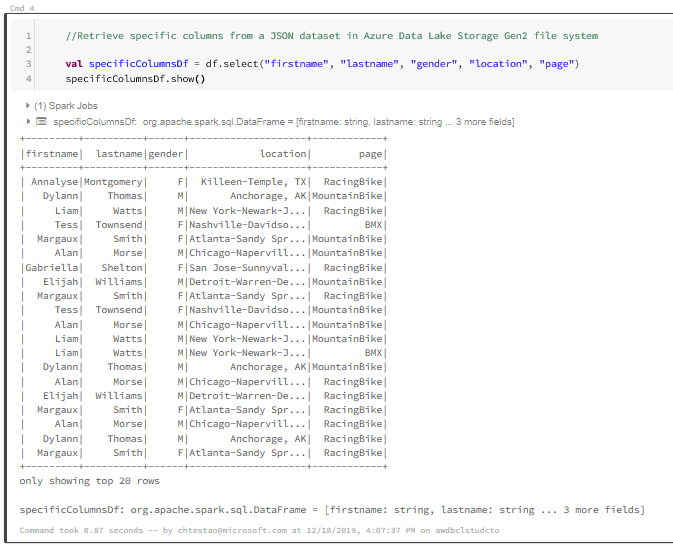

# DP 200 - 实施数据平台解决方案
# 实验室 2 - 通过 Azure Databricks 启用基于团队的数据科学

**预计用时**：75 分钟

**先决条件**：假设已阅读了本实验室的案例研究。假设模块 1 的内容和实验：数据工程师的 Azure 也已完成

**实验室文件**：本实验室文件位于 _Allfiles\Labfiles\Starter\DP-200.3_ 文件夹。

## 实验室概述

在本实验室课程结束时，学生将能够解释为什么 Azure Databricks 可用于帮助数据科学项目。学生将预配 Azure Databricks 实例，然后创建工作区，用于执行 Data Lake Store Gen2 存储中简单的数据准备任务。最后，学生将使用 Azure Databricks 按步骤实行转换。

## 实验室目标
  
完成本实验室后，你将能够：

1. 解释 Azure Databricks
2. 使用 Azure Databricks
3. 使用 Azure Databricks 读取数据
4. 使用 Azure Databricks 执行转换

## 场景
  
为了响应信息服务 (IS) 部门，你将通过列出使用该技术的好处来开始构建预测分析平台的过程。数据科学家将加入该部门，他们希望确保新团队成员可以使用预测分析环境。

你将建立并预配 Azure Databricks 环境，然后通过从预先存在的 Data Lake Storage Gen2 帐户中引入数据，在服务上执行简单的数据准备例程来测试此环境是否正常工作。作为一名数据工程师，已经向你表明，你可能需要帮助数据科学家执行数据准备练习。为此，我们建议你浏览一下可以帮助你执行基本转换的笔记本。

在本实验室课程结束时，你将能够：

1. 介绍 Azure Databricks
2. 使用 Azure Databricks
3. 使用 Azure Databricks 读取数据
4. 使用 Azure Databricks 执行转换

> **重要事项**：在完成本实验室课程时，请记下你在任何设置或配置任务中遇到的任何问题，并将其记录在位于 \Labfiles\DP-200-Issues-Doc.docx__ 的文档的表格中。记录实验室编号，记录技术，说明问题以及解决方案的内容。保存该文档，以便在稍后的模块中参考它。

## 练习 1：解释 Azure Databricks

>**重要事项**：首先执行 **练习 2**，并在练习 2 中开始创建 Databricks 群集后返回练习 1，预配需要 10 分钟。

预计用时：15 分钟

个人练习
  
本练习的主要任务如下：

1. 根据你在本课程中学到的内容，确定 Azure Databricks 将满足的数字转换要求以及 Azure Databricks 的候选数据源。

2. 教师将与小组讨论结果。

### 任务 1：定义数字转型和候选数据源。

1. 从实验室虚拟机中，启动 **Microsoft Word**，然后从 **Allfiles\Labfiles\Starter\DP-200.3** 文件夹中打开文件 **DP-200-Lab03-Ex01.docx**。

2. 花 **10 分钟** 记录案例研究和本实验场景中概述的数字转换要求和候选数据源。

### 任务 2：与教师讨论结果

1. 教师将使小组停下来讨论结果。

> **结果**：完成本练习后，你已创建一个 Microsoft Word 文档，该文档标识 Azure Databricks 将满足的数字转换要求和候选数据源。

## 练习 2：使用 Azure Databricks
  
预计用时：20 分钟

个人练习
  
本次练习的主要任务如下：

1. 在资源组中创建 Azure Databricks 高级层实例。

2. 打开 Azure Databricks

3. 启动 Databricks 工作区并创建 Spark 群集

### 任务 1：创建并配置 Azure Databricks 实例。

1. 在 Azure 门户网站的屏幕左上方，单击 **主页** 超链接。

2. 在 Azure 门户中，单击 **“+ 创建资源”** 图标。

3. 在“新建”屏幕中，单击 **“搜索市场”** 文本框，然后输入 **“databricks”**。在显示的列表中单击 **“Azure Databricks”**。

4. 在 **Azure Databricks** 边栏选项卡中，单击 **创建**。

5. 在 **“Azure Databricks 服务”** 边栏选项卡中，使用以下设置创建 Azure Databricks 工作区：

    - **工作区名称**：**awdbwsstudxx**，其中 **xx** 是你的姓名缩写。

    - **订阅**：你用于本实验室的订阅名称

    - **资源组**： **awrgstudxx**，其中 **xx** 是你的姓名缩写。

    - **位置**：最靠近实验室位置的 Azure 区域的名称，在其中你能预配 Azure VM 的位置。

    - **定价层**：**高级（+ 基于角色的访问控制）**。


        

6. 在 **“Azure Databricks Service”** 边栏选项卡中，点击 **“创建”**。

   > **备注**：预配大约需要 3 分钟。Databricks Runtime 在 Apache Spark 的基础之上构建，并且是为 Azure 云原生构建。Azure Databricks 完全转移出基础结构的复杂性以及对设置和配置数据基础结构的专业知识的需求。对于注重生产作业性能的数据工程师，Azure Databricks 通过 I/O 层和处理层（Databricks I / O）的各种优化提供了更快、更高效的 Spark 引擎。
   
### 任务 2：打开 Azure Databricks。

1. 确认已创建 Azure Databricks 服务。

2. 在 Azure 门户中，导航到 **“资源组”** 屏幕。

3. 在“资源组”屏幕中，单击 **“awrgstudxx”**资源组，其中 **“xx”**是你的姓名首字母缩写。

4. 在 **“awrgstudxx”** 屏幕中，单击 **“awdbwsstudxx”**，其中 **“xx”** 是用于打开 Azure Databricks 的你的姓名首字母缩写。这将打开你的 Azure Databricks 服务。

    

### 任务 3：启动 Databricks 工作区并创建 Spark 群集。

1. 在 Azure 门户中，在 **awdbwsstudxx** 屏幕中，点击按钮 **启动工作区**。

    > **备注**：你将在 Microsoft Edge 的单独选项卡中登录 Azure Databricks 工作区。

2. 在 **常见任务** 下，单击 **新群集**。

3. 在**创建群集**屏幕中，在“新群集”下，使用以下设置创建 Databricks 群集，然后单击**创建群集**：

    - **群集名称**：**awdbclstudxx**，其中 **xx** 是你的姓名缩写。

    - **群集模式**：**标准**

    - **池**：**无**

    - **Databricks Runtime 版本**：**运行时：7.4（Scala 2.12、Spark 3.0.1）**
    
    - **Python 版本**：**2**

    - 确保选中 **“不活动 60 分钟后终止”** 复选框。如果未使用群集，则请提供一个持续时间（以分钟为单位），超过该时间后群集会被终止。

    - **工作器节点数下限**：**1**

    - **工作器节点数上限**：**2**

    - 将所有剩余选项保留为其当前设置。

        

4. 在 **“创建群集”** 屏幕中，单击 **“创建群集”** 并打开 Microsoft Edge 屏幕。

> **备注**：创建 Azure Databricks 实例大约需要 10 分钟，因为通过图形用户界面简化了 Spark 群集的创建。你将注意到在创建群集时的**待执行**的**状态**。当创建群集时，其将更改为**运行**。

> **备注**：在创建群集时，**返回执行练习 1**。

## 练习 3：使用 Azure Databricks 读取数据

预计用时：30 分钟

个人练习

本次练习的主要任务如下：

1. 确认 Databricks 群集已创建。

2. 收集 Azure Data Lake Store Gen2 帐户名称

3. 让你的 Databricks 实例能够访问 Data Lake Gen2 Store。

4. 创建 Databricks 笔记本并连接到 Data Lake Store。

5. 读取 Azure Databricks 中的数据。

### 任务 1：确认 Databricks 群集的创建

1. 返回 Microsoft Edge，在 **“交互群集”** 下确认命名为 **“awdbclstudxx”** 的群集的状态列被设置为 **“运行”**，其中 **“xx”** 是你的姓名首字母缩写。

### 任务 2：收集 Azure Data Lake Store Gen2 帐户名称

1. 在 Microsoft Edge 中，单击“Azure 门户”选项卡，单击 **“资源组”**，然后单击 **“awrgstudxx”**，再单击 **“awdlsstudxx”**，其中 **xx** 是你的姓名缩写。

2. 在 **awdlsstudxx** 屏幕中的“设置”下，单击 **“访问键”**，然后单击 **“存储帐户名称”** 旁边的复制图标并将其粘贴到记事本中。

    

### 任务 3：让你的 Databricks 实例能够访问 Data Lake Gen2 Store。

1. 在 Azure 门户中，单击 **“主页”** 超链接，然后单击 **“Azure 活动目录”** 图标。

2. 在 **“Microsoft - 概述”** 屏幕中，单击 **“应用注册”**。

3. 在 **Microsoft - 应用注册** 屏幕中，单击 **“+ 新注册”** 按钮。

4. 在注册应用程序屏幕中，提供 **DLAccess** 的 **名称**，并在 **“重定向 URI (可选)”** 版块下，确保已选择 **“网页”** 并针对应用程序价值输入 **http://localhost**。设置值之后。

    

5. 单击 **“注册”**。将出现 DLAccess 屏幕。

6. 在 **DLAccess** 注册应用程序屏幕中，复制 **应用程序（客户端）ID** 和 **目录（租户）ID**，并将两者粘贴到记事本中。

7. 在 “已注册 **DLAccess** 的应用”屏幕，单击 **“证书和密钥”**，然后单击 **“+ 新建客户端密钥”**

8. 在“添加客户端密钥”屏幕，输入 **“DL Access密钥”** 的 **“说明”**，以及密钥的 **“持续时间”** 为 **“1 年内”**。完成后，单击 **“添加”**。

    

    >**重要事项**：当你单击 **“添加”** 时，密钥将如下图所示。你只有一次机会复制此密钥值到记事本中

    

9. 复制 **应用程序密钥值** 并将其粘贴到记事本中

10. 将存储 Blob 数据贡献者权限分配至资源组。在 Azure 门户中，单击 **“主页”** 超链接，然后单击 **“资源组”** 图标，单击资源组 **“awrgstudxx”**，其中 **“xx”** 是你的姓名首字母缩写。

11. 在 **awrgstudxx** 屏幕中，单击 **“访问控制 (IAM)”** 

12. 单击 **“角色分配”** 标签页。 

13. 单击 **“+ 添加”**，然后单击 **“添加角色分配”**

14. 在 **“添加角色分配”** 边栏选项卡中，在“角色”下，选择 **“存储 Blob 数据参与者”**。

15. 在 **“添加角色分配”** 边栏选项卡中，在“选择”下，选择 **“DLAccess”** ，然后单击 **“保存”**。

16. 在 Azure 门户中，单击 **“主页”** 超链接，然后单击 **Azure Active Directory** 图标，注意 **你的角色**。如果你具有“用户”角色，则必须确保非管理员可以注册应用程序。

17. 单击 **“用户”**，然后单击 **“用户 - 所有用户”** 边栏选项卡中的 **“用户设置”**，检查 **“应用注册”** 设置。该值只能由管理员进行设置。如果设置为“是”，则 Azure AD 租户中的任何用户都可以注册应用程序。 

18. 关闭 **“用户 - 所有用户”** 屏幕。

19. 在“Azure Active Directory”边栏选项卡中，单击 **“属性”**。

20. 单击**目录 ID**旁边的“复制”图标，获取你的租户 ID 并将其粘贴到记事本中。

21. 将记事本文档保存在 **Allfiles\Labfiles\Starter\DP-200.3** 文件夹中，作为 **DatabricksDetails.txt**

### 任务 4：创建 Databricks 笔记本并连接到 Data Lake Store。

1. 在 Microsoft Edge 中，单击选项卡**群集 -  Databricks**

    > **备注**：你将看到群集页面。

2. 在 Microsoft Edge 左侧的 Azure Databricks 边栏选项卡中，单击**工作区**下，单击**工作区**旁边的下拉菜单，然后转到**创建**，再单击**笔记本**。

3. 在**创建笔记本**屏幕中，对**我的笔记本**进行命名。

4. 然后转到**语言**下拉列表，选择**Scala**。

5. 确保群集的名称是你之前创建的群集的名称，单击**创建**

    

     > **备注**：这样将打开标题为我的笔记本 (Scala) 的笔记本。

6. 在笔记本中，在单元格 **“Cmd 1”** 中，复制以下代码并将其粘贴到单元格中：

    ```scala
    //Connect to Azure Data Lake Storage Gen2 account

    spark.conf.set("fs.azure.account.auth.type", "OAuth")
    spark.conf.set("fs.azure.account.oauth.provider.type", "org.apache.hadoop.fs.azurebfs.oauth2.ClientCredsTokenProvider")
    spark.conf.set("fs.azure.account.oauth2.client.id.<storage-account-name>.dfs.core.windows.net", "<application-id>")
    spark.conf.set("fs.azure.account.oauth2.client.secret.<storage-account-name>.dfs.core.windows.net", "<authentication-key>")
    spark.conf.set("fs.azure.account.oauth2.client.endpoint.<storage-account-name>.dfs.core.windows.net", "https://login.microsoftonline.com/<tenant-id>/oauth2/token")
    ```

7. 在此代码块中，使用你之前采集并保存在记事本中的值替换此代码块中的 **“application-id”**、**“authentication-id”**、**“tenant-id”**、**“file-system-name”** 和 **“storage-account-name”** 占位符值。

8. 在笔记本中，在 **“Cmd 1”** 下的单元格中，单击 **“运行”** 图标，然后单击 **“运行单元格”**，如下图所示。 

    

    >**注**：将在单元格底部返回消息，说明“命令花了 0.0X 秒 - 2019 年 4 月 4 日，下午 2:46:48 由人员在 awdbclstudxx 上执行”

### 任务 5：读取 Azure Databricks 中的数据。

1. 在笔记本中，将鼠标悬停在单元格 **Cmd 1** 右上角，然后点击 **“在下方添加单元格”** 图标。将出现一个名为 **Cmd2** 的新单元格。

    

2. 在笔记本中，在单元格 **“Cmd 2”** 中，复制以下代码并将其粘贴到单元格中：

    ```scala
    //Read JSON data in Azure Data Lake Storage Gen2 file system

    val df = spark.read.json("abfss://<file-system-name>@<storage-account-name>.dfs.core.windows.net/preferences.json")
    ```

3. 在此代码块中，使用 **“logs”** 一词替换 **“file-system-name”**，使用你之前采集并保存在记事本中的值替换此代码块中的 **“storage-account-name”** 占位符值。

4. 在笔记本中，在 **Cmd 2** 单元格下单击 **“运行”** 图标，然后单击 **“运行单元格”**。 

    > **注**将在单元格底部返回消息，说明 Spark 工作已执行，“命令花了 0.0X 秒 - 2019 年 4 月 4 日，下午 2:46:48 由人员在 awdbclstudxx 上执行”

5. 在笔记本中，将鼠标悬停在单元格 **Cmd 2** 右上角，然后单击 **“在下方添加单元格”** 图标。将出现一个名为 **Cmd3** 的新单元格。

6. 在笔记本中，在单元格 **“Cmd 3”** 中，复制以下代码并将其粘贴到单元格中：

    ```scala
    //Show result of reading the JSON file
  
    df.show()
    ```

    

7. 在笔记本中，在 **Cmd 3** 单元格下单击 **“运行”** 图标，然后单击 **“运行单元格”**。

    > **注**将在单元格底部返回消息，说明 Spark 工作已执行，返回了结果表，“命令花了 0.0X 秒 - 2019 年 4 月 4 日，下午 2:46:48 由人员在 awdbclstudxx 上执行”

8. 保持 Azure Databricks 笔记本打开

>**结果**：在本练习中，你已执行必要的步骤，以设置 Azure Databricks 访问 Azure Data Lake Store Gen2 中的数据的权限。然后，你使用 scala 连接到 Data Lake Store，然后读取数据并创建显示人员偏好的输出表。

## 练习 4：使用 Azure Databricks 执行基本转换

预计用时：10 分钟

个人练习

本次练习的主要任务如下：

1. 检索数据集上的特定列

2. 在数据集上执行列的重命名

3. 添加注释

4. 如果时间允许：其他转换

### 任务 1：检索数据集上的特定列

1. 在笔记本中，将鼠标悬停在单元格 **Cmd 3** 右上角，然后单击 **“在下方添加单元格”** 图标。将出现一个名为 **Cmd4** 的新单元格。

2. 在笔记本中，在单元格 **“Cmd 4”** 中，复制以下代码并将其粘贴到单元格中：

    ```scala
    //Retrieve specific columns from a JSON dataset in Azure Data Lake Storage Gen2 file system
    
    val specificColumnsDf = df.select("firstname", "lastname", "gender", "location", "page")
    specificColumnsDf.show()
    ```

3. 在笔记本中，在 **Cmd 4** 单元格下单击 **“运行”** 图标，然后单击 **“运行单元格”**。 

    > **注**将在单元格底部返回消息，说明 Spark 工作已执行，返回了结果表，“命令花了 0.0X 秒 - 2019 年 4 月 4 日，下午 2:46:48 由人员在 awdbclstudxx 上执行”

    

### 任务 2：在数据集上执行列的重命名

1. 在笔记本中，将鼠标悬停在单元格 **Cmd 4** 右上角，然后单击 **“在下方添加单元格”** 图标。将出现一个名为 **Cmd5** 的新单元格。

2. 在笔记本中，在单元格 **“Cmd 5”** 中，复制以下代码并将其粘贴到单元格中：

    ```scala
    //Rename the page column to bike_preference

    val renamedColumnsDF = specificColumnsDf.withColumnRenamed("page", "bike_preference")
    renamedColumnsDF.show()
    ```

3. 在笔记本中，在 **Cmd 5** 单元格下单击 **“运行”** 图标，然后单击 **“运行单元格”**。 

    > **注**将在单元格底部返回消息，说明 Spark 工作已执行，返回了结果表，“命令花了 0.0X 秒 - 2019 年 4 月 4 日，下午 2:46:48 由人员在 awdbclstudxx 上执行”

    

### 任务 3：添加注释

1. 在笔记本中，将鼠标悬停在单元格 **Cmd 5** 右上角，然后单击 **“在下方添加单元格”** 图标。将出现一个名为 **Cmd6** 的新单元格。

2. 在笔记本中，在单元格 **“Cmd 6”** 中，复制以下代码并将其粘贴到单元格中：

    ```文本
    此代码连接到名为“数据”的 Data Lake Storage 文件系统，并读取存储在该数据湖中的 preferences.json 文件中的数据。然后创建了简单查询来检索数据，并且“页码”列已重命名为“bike_preference”。
    ```

3. 在笔记本中，在 **Cmd 6** 单元格下单击 **“向下箭头”** 图标，然后单击 **“向上”**。重复单击，直到单元格出现在笔记本的顶部。

4. 保持 Azure Databricks 笔记本打开

    > **注**未来的实验室将探索如何将这些数据导出到另一种数据平台技术

> **结果**：完成本练习后，你已经在笔记本中创建了注释。

### 任务 4：如果时间允许或针对课程后审查

如果你提前完成了此实验，则以下部分提供了能帮助你了解有关 Azure 中基本和高级转换的更多信息的内容的链接。

如果 url 不可访问，则在_Allfiles\Labfiles\Starter\DP-200.3\Post Course Review_文件夹存在笔记本图标的拷贝

**基本转换**

1. 在工作区中，使用左侧的命令栏，选择 **“工作区”**、**“用户”**，然后选择 **“你的用户名”** （带房子图标的条目）。

2. 在出现的边栏选项卡中，选择**你的名称旁边的向下指向V形符号**，然后选择**导入**。

3. 在“导入笔记本”对话框中，选择 **以下 URL**，然后粘贴以下 URL： 

```url
    https://github.com/MicrosoftDocs/mslearn-perform-basic-data-transformation-in-azure-databricks/blob/master/DBC/05.1-Basic-ETL.dbc?raw=true
```

4. 选择 **“导入”**。

5. 导入后，应出现名为 **05.1-Basic-ETL** 的文件夹。选择该文件夹。

6. 该文件夹将包含一个或多个笔记本，你可以使用这些笔记本来学习使用 **scala** 或 **python** 的基本的转换。

按照笔记本中的说明操作，直到完成整个笔记本中的操作为止。然后继续按顺序完成笔记本中的操作：

- **01-Course-Overview-and-Setup（01-课程概述和设置）** - 本笔记本帮助你启用 Databricks 工作区。
- **02-ETL-Process-Overview（02-过程概述）** - 本笔记本包含帮助你查询的练习、大型数据文件并将你的结果可视化。
- **03-Connecting-to-Azure-Blob-Storage（03-连接至Azure-Blob存储）** - 你在本笔记本中执行基本累加和联接。
- **04-Connecting-to-JDBC（04-连接到JDBC）** - 本笔记本列出了使用Databricks从各种来源访问数据的步骤。
- **05-Applying-Schemas-to-JSON（05-将架构应用至JSON）** - 在本笔记本中，你将学习如何使用DataFrames查询JSON和分层数据
- **06-Corrupt-Record-Handling（06-损坏数据处理）** - 本笔记本列出了具有以下特性的练习：帮助你了解如何创建ADLS并使用Databricks DataFrames查询和分析此数据。
- **07-Loading-Data-and-Productionalizing（07-加载数据和处理）** - 在此你可以使用Databricks在Azure Data Lake Storage Gen2中查询和分析数据存储。
- **Parsing-Nested-Data（解析嵌套数据）** - 本笔记本位于“可选”子文件夹中，其中包含一个示例项目，供你稍后自行浏览。

> [注]你可以在“解决方案”子文件夹中找到相应的笔记本。这些包含完成的练习单元，要求你完成一个或多个挑战。如果你遇到困难或只是想查看解决方案，请参阅这些内容。

**高级转换**

1. 在工作区中，使用左侧的命令栏，选择 **“工作区”**、**“用户”**，然后选择 **“你的用户名”** （带房子图标的条目）。

2. 在出现的边栏选项卡中，选择**你的名称旁边的向下指向V形符号**，然后选择**导入**。

3. 在“导入笔记本”对话框中，选择 **以下 URL**，然后粘贴以下 URL： 

```url
    https://github.com/MicrosoftDocs/mslearn-perform-advanced-data-transformation-in-azure-databricks/blob/master/DBC/05.2-Advanced-ETL.dbc?raw=true
```

4. 选择 **“导入”**。

5. 导入后，应出现名为 **05.2-Advanced-ETL** 的文件夹。选择该文件夹。

6. 该文件夹将包含一个或多个笔记本，你可以使用这些笔记本来学习使用 **scala** 或 **python** 的基本的转换。

按照笔记本中的说明操作，直到完成整个笔记本中的操作为止。然后继续按顺序完成笔记本中的操作：

- **01-Course-Overview-and-Setup（01-课程概述和设置）** - 本笔记本帮助你启用 Databricks 工作区。
- **02-Common-Transformations（02-常规转换）** - 在本笔记本中，你可以使用Spark内置函数执行一些常见的数据转换。
- **03-User-Defined-Functions（03用户自定义函数）** - 在此笔记本中，你可以使用用户定义的函数执行自定义转换
- **04-Advanced-UDF（04-高级的UDF）** - 在本笔记本中，你能使用高级用户定义函数来执行一些复杂的数据转换。
- **05-Joins-and-Lookup-Tables（05-加入和查对表）** - 在本笔记本中，你将学习如何使用表格的标准和广播联接。
- **06-Database-Writes（06-数据库书写）** - 本笔记本包含以下练习：并行地将数据写入多个目标数据库，从ETL作业中存储转换后的数据。
- **07-Table-Management（07-表的管理）** - 在这里，你可以处理管理和未管理的表，以优化你的数据存储。
- **Custom-Transformations（自定义转换）** - 本笔记本位于“可选”子文件夹中，其中包含一个示例项目，供你稍后自行浏览。

>[注]你可以在“解决方案”子文件夹中找到相应的笔记本。这些包含完成的练习单元，要求你完成一个或多个挑战。如果你遇到困难或只是想查看解决方案，请参阅这些内容。
