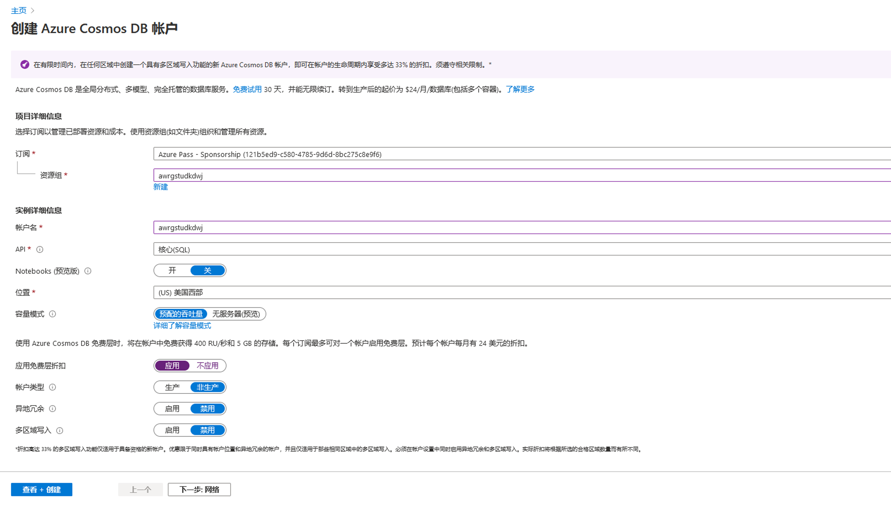
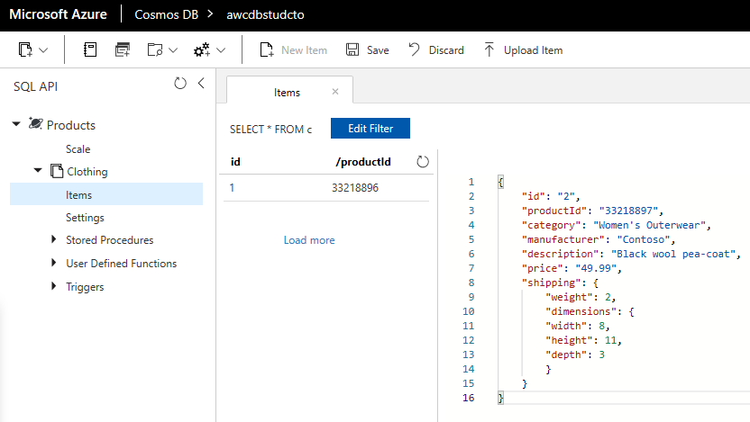
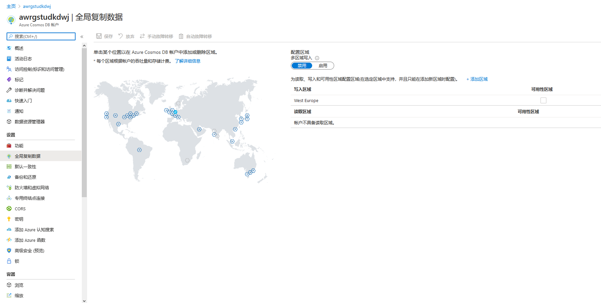
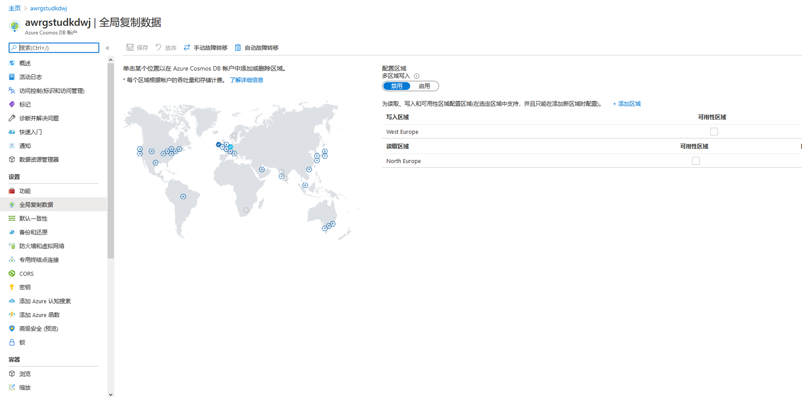

---
lab:
    title: '使用 Cosmos DB 构建全球分布式数据库'
    module: '模块 4:使用 Cosmos DB 建立全局分布式数据库'
---

# DP 200 - 实施数据平台解决方案
# 实验室 4 - 使用 Cosmos DB 构建全球分布式数据库

**预计用时**： 60 分钟

**先决条件**： 假设已阅读了本实验室的案例研究。假设模块 1 的内容和实验：适用于数据工程师的 Azure 也已完成

**实验室文件**： 本实验室的文件位于 _Allfiles\Labfiles\Starter\DP-200.4_ 文件夹中。

## 实验室概述

学生将能够描述和演示 Azure Cosmos DB 可为组织带来的功能。他们将能够创建 Cosmos DB 实例，并展示如何通过门户网站和 .Net 应用程序上传和查询数据。然后，他们将能够演示如何启用 Cosmos DB 数据库的全局扩展。

## 实验室目标
  
完成本实验室课程后，你将能够：

1. 创建按比例构建的 Azure Cosmos DB 数据库
1. 在 Azure Cosmos DB 数据库中插入和查询数据
1. 使用 Azure Cosmos DB 全局分布数据

## 方案
  
AdventureWorks 的开发人员和信息服务部门意识到最近在 Azure 上发布的一项名为 Cosmos DB 的新服务可以近乎实时地提供对数据的全球规模访问。他们希望了解此服务可以提供的功能以及它如何为 AdventureWorks 带来价值，以及在什么情况下使用。

信息服务部门希望了解如何设置服务以及如何上传数据。开发人员希望看到可用于将数据上传到 Cosmos 的应用程序示例。两者都想了解如何满足全球规模的要求。

在本实验室结束时，你将可以：

1. 创建按比例构建的 Azure Cosmos DB 数据库
1. 在 Azure Cosmos DB 数据库中插入和查询数据
1. 使用 Azure Cosmos DB 全局分布数据

> **重要事项**： 在完成本实验室课程时，请记下你在任何设置或配置任务中遇到的任何问题，并将其记录在位于 _\Labfiles\DP-200-Issues-Doc.docx_ 的文档的表格中。记录实验室编号，记录技术，说明问题以及解决方案的内容。保存该文档，以便在稍后的模块中参考它。

## 练习 1：创建按比例构建的 Azure Cosmos DB 数据库

预计用时：10 分钟

个人练习
  
本练习的主要任务如下：

1. 创建 Azure Cosmos DB 实例

### 任务 1：创建 Azure Cosmos DB 实例

1. 在 Azure 门户中，如有必要，请单击 **“主页”** 超链接。

1. 导航到 **“+ 创建资源”** 图标。

1. 在“新建”屏幕中，单击 **“搜索市场”** 文本框，然后输入 **“Cosmos”**。在显示的列表中点击 **Azure Cosmos DB**。

1. 在 **Azure Cosmos DB** 屏幕中，单击 **“创建”**。

1. 从**创建 Azure Cosmos 数据库帐户**屏幕中，使用以下设置创建 Azure Cosmos DB 帐户：

    - 在“项目详细信息”屏幕中，输入以下信息
    
        - **订阅**： 你用于本实验室的订阅名称

        - **资源组**： **awrgstudxx**，其中 **XX** 是你的姓名缩写

    - 在“实例详细信息”屏幕中，输入以下信息

        - **帐户名**： **Awcdbstudxx**，其中 **XX** 是你的姓名缩写。

        - **API**： **核心 (SQL)**

        - **笔记本（预览）**： **关闭**

        - **位置**：最靠近实验室位置的 Azure 区域的名称，在其中你能设置 Azure VM 的位置。

        - 将所有其余选项保留为默认设置。

            

1. 在**创建 Azure Cosmos 数据库帐户**边栏选项卡中，点击**查看+创建**。

1. 确认创建** Azure Cosmos DB 帐户**边栏选项卡后，单击**创建**。

   > **注意**： 这大约需要5分钟。在这些实验中经常避免在 Azure 中配置服务时对其他选项卡的说明。你可能会注意到，在配置屏幕中存在其他选项卡，例如：“网络”、“标签”或“高级”。这使你可以定义服务的任何自定义设置。例如，许多服务的网络选项卡使你可以定义虚拟网络的配置，以便你能够针对给定的数据服务控制和保护网络流量。“标记”选项是名称/值对，使你可以通过将相同标记应用于多个资源和资源组来对资源进行分类并查看合并计费。高级选项卡将根据拥有高级选项卡的服务而有所不同。但重要的是注意：你可以控制这些区域，并且你希望与网络管理员或财务部门协作，以了解应如何配置这些选项。

1. 配置完成后，将显示“你的部署已完成”的屏幕，单击**转到资源**并进入下一个练习。 

> **结果**在本练习中，你已配置 Azure Cosmos DB 帐户

## 练习 2：在 Azure Cosmos DB 数据库中插入和查询数据
  
预计用时：20 分钟

个人练习
  
本练习的主要任务如下：

1. 设置 Azure Cosmos DB 数据库和容器 

1. 使用门户添加数据

1. 在 Azure 门户中运行查询

1. 对数据运行复杂的操作

### 任务 1：设置 Azure Cosmos DB 容器和数据库

1. 在 Azure 门户中，一旦完成了 Cosmos DB 的部署，请单击 **“转到资源”** 按钮。

1. 在“Cosmos DB”屏幕中，单击 **“概述”** 链接。

1. 在 **awcdbstudxx** 屏幕中，单击 **+添加容器**。这将通过 **“添加容器”** 边栏选项卡，打开 **awcdbstudxx 数据资源管理器**。

1. 在 **“添加容器”** 边栏选项卡中，使用名为 Clothing 的容器，使用以下设置创建产品数据库：

    - **数据库 ID**： **产品**
    
    - **吞吐量**：  **400 个**

    - **容器 ID**：  **Clothing**

    - **分区键**： **/productId**

    - 将其余选项保留为默认值

        

1. 在 **“添加容器”** 屏幕中，单击 **“确定”**

### 任务 2：使用门户添加数据

1. 在 **awcdbstudcto - 数据资源管理器**屏幕中，在数据资源管理器工具栏上“新建容器合”按钮对面，单击 **“打开全屏”** 按钮。在“打开全屏”对话框中，单击**打开**。Microsoft Edge 中将打开一个新选项卡。

1. 在 **“SQL API”** 窗格中，单击“刷新”图标，然后依次展开 **“产品”**、 **“Clothing”** ，然后单击 **“项目”**。 

1. 在“文档”窗格中，单击**新项目**图标。将出现包含你现在将替换的示例 JSON 的新文档。

1. 复制以下代码并将其粘贴到**文档**标签：

    ```JSON
    {
       "id": "1",
       "productId": "33218896",
       "category": "Women's Clothing",
       "manufacturer": "Contoso Sport",
       "description": "Quick dry crew neck t-shirt",
       "price": "14.99",
       "shipping": {
           "weight": 1,
           "dimensions": {
           "width": 6,
           "height": 8,
           "depth": 1 个
          }
       }
    }
    ```

    

1. 将 JSON 添加到“文档”选项卡后，单击**保存**。

1. 在“文档”窗格中，单击**新项目**图标。

1. 复制以下代码并将其粘贴到**项目**选项卡：

    ```JSON
    {
        "id": "2",
        "productId": "33218897",
        "category": "Women's Outerwear",
        "manufacturer": "Contoso",
        "description": "Black wool pea-coat",
        "price": "49.99",
        "shipping": {
            "weight": 2,
            "dimensions": {
            "width": 8,
            "height": 11,
            "depth": 3 个
            }
        }
    }
    ```

    

1. 将 JSON 添加到“文档”选项卡后，单击**保存**。

1. 你可以通过单击左侧菜单上的每个文档来查看已保存的每个文档。ID 为 1 的第一项的值为 **33218896**，它是以 productid 命名的，第二项的值将是 **33218897**

### 任务 3：在 Azure 门户中运行查询。

1. 在 Azure 门户中，在 **“项目”** 屏幕中，单击 **“新建 SQL 查询”** 按钮，其位于 **SQL API** 边栏选项卡和 **“刷新”** 图标上方。

    > **注意**：出现查询 1 屏幕选项卡，显示查询 **SELECT * FROM c** 进行选择。

1. 替换返回 JSON 文件的查询，该文件显示 productId 1 的详细信息。

    ```SQL
    SELECT *
    FROM Products p
    WHERE p.id ="1"
    ```

1. 单击 **“执行查询”** 图标。返回以下结果

    ```JSON
    [
        {
            "id": "1",
            "productId": "33218896",
            "category": "Women's Clothing",
            "manufacturer": "Contoso Sport",
            "description": "Quick dry crew neck t-shirt",
            "price": "14.99",
            "shipping": {
                "weight": 1,
                "dimensions": {
                    "width": 6,
                    "height": 8,
                    "depth": 1 个
                }
            },
            "_rid": "I2YsALxG+-EBAAAAAAAAAA==",
            "_self": "dbs/I2YsAA==/colls/I2YsALxG+-E=/docs/I2YsALxG+-EBAAAAAAAAAA==/",
            "_etag": "\"0000844e-0000-1a00-0000-5ca79f840000\"",
            "_attachments": "attachments/",
            "_ts": 1554489220 个
        }
    ]
    ```

    

1. 在现有的查询窗口中。编写在 productId 的 JSON文件 中返回 id、manufacturer（制造商）和description（说明）的查询 

    ```SQL
    SELECT
        p.id,
        p.manufacturer,
        p.description
    FROM Products p
    WHERE p.id ="1"
    ```

1. 单击 **“执行查询”** 图标。返回以下结果

    ```JSON
    [
    {
        "id": "1",
        "manufacturer": "Contoso Sport",
        "description": "Quick dry crew neck t-shirt"
    }
    ]
    ```

    

1. 在现有查询窗口中，编写按价格升序返回所有产品的价格、说明和产品 ID 的查询。

    ```SQL
    SELECT p.price, p.description, p.productId
    FROM Products p
    ORDER BY p.price ASC
    ```

1. 单击 **“执行查询”** 图标。返回以下结果

    ```JSON
    [
        {
            "price": "14.99",
            "description": "Quick dry crew neck t-shirt",
            "productId": "33218896"
        },
        {
            "price": "49.99",
            "description": "Black wool pea-coat",
            "productId": "33218897"
        }
    ]
    ```

    

### 任务 4：对数据运行复杂的操作

1. 在 Azure 门户中，在**项目**屏幕中，单击**新的存储流程**按钮。

    > **注意**：将出现显示示例存储过程的新存储流程屏幕。

1. 在“新存储流程”屏幕中，在**存储流程 ID** 文本框中输入 **createMyDocument**。

1. 使用以下代码在存储流程体中创建存储流程。

    ```Javascript
    function createMyDocument() {
        var context = getContext();
        var collection = context.getCollection();

        var doc = {
            "id": "3",
            "productId": "33218898",
            "description": "Contoso microfleece zip-up jacket",
            "price": "44.99"
        };

        var accepted = collection.createDocument(collection.getSelfLink(),
            doc,
            function (err, documentCreated) {
                if (err) throw new Error('Error' + err.message);
                context.getResponse().setBody(documentCreated)
            });
        if (!accepted) return;
    }
    ```

1. 在“新存储流程”屏幕中，单击**保存**。

1. 在“新存储流程”屏幕中，单击**执行**。

1. 在输入参数屏幕中，**类型**应该设置为**字符串**和**数值**，其中数值在**分区键值数值**文本框中设为 **33218898**，然后单击**执行**。

返回以下结果

    ```JSON
    {
        "id": "3",
        "productId": "33218898",
        "description": "Contoso microfleece zip-up jacket",
        "price": "44.99",
        "_rid": "I2YsALxG+-EDAAAAAAAAAA==",
        "_self": "dbs/I2YsAA==/colls/I2YsALxG+-E=/docs/I2YsALxG+-EDAAAAAAAAAA==/",
        "_etag": "\"0000874e-0000-1a00-0000-5ca7a7050000\"",
        "_attachments": "attachments/"
    }
    ```

1. 在 Azure 门户中的“数据资源管理器”屏幕中，单击 **“新建存储流程”** 的下拉按钮并单击 **“新建 UDF”**。

    > **注意**：将出现显示 **function userDefinedFunction(){}** 的新 UDF 1 屏幕

1. 在“新建定义的函数”屏幕中，在 **“用户定义的函数 ID”** 文本框中输入 **producttax**。

1. 使用以下代码在用户定义函数体中创建用户定义函数。

    ```Javascript
    function producttax(price) {
        if (price == undefined) 
            throw 'no input';

        var amount = parseFloat(price);

        if (amount < 1000) 
            return amount * 0.1;
        else if (amount < 10000) 
            return amount * 0.2;
        else
            return amount * 0.4;
    }
    ```

1. 在 New UDF 1 屏幕中，单击**保存**。

1. 单击“查询 1”选项卡，然后使用以下查询替换现有查询：

    ```SQL
    SELECT c.id, c.productId, c.price, udf.producttax(c.price) AS producttax FROM c
    ```

1. 在“查询 1”屏幕中，单击**执行查询**。

返回以下结果

    ```JSON
    [
        {
            "id": "1",
            "productId": "33218896",
            "price": "14.99",
            "producttax": 1.499 个
        },
        {
            "id": "2",
            "productId": "33218897",
            "price": "49.99",
            "producttax": 4.9990000000000005 个
        },
        {
            "id": "3",
            "productId": "33218898",
            "price": "44.99",
            "producttax": 4.4990000000000005 个
        }
    ]
    ```

## 练习 3：使用 Azure Cosmos DB 全局分布数据

预计用时：15 分钟

个人练习

本练习的主要任务如下：

1. 将数据复制到多个区域

1. 管理故障转移

### 任务 1：将数据复制到多个区域

1. 在 Microsoft Edge 中，单击 **“awcdbstudxx - 数据资源管理器”** 选项卡。

1. 如果出现指示“连接错误”的消息，请单击**刷新**按钮。

1. 在 **“awcdbstudxx - 数据资源管理器”** 窗口中，单击 **“全局复制数据”**

    

1. 在世界地图上，单击你所在大陆内的数据中心位置，然后单击**保存**。

> **注**  配置额外的数据中心大约需要 7 分钟

### 任务 2：管理故障转移。

1. 在 **awcdbstudxx - 全球复制数据**窗口中，单击**手动故障转移**。

1. 单击 **“读取区域”** 数据中心位置，然后单击“我理解并同意在当前写入区域上触发故障转移”旁边的复选框，然后单击 **“确定”**。

> **注**  手动故障转移大约需要 3 分钟。屏幕将如下所示。注意图标颜色已更改



1. 在 **“awcdbstudxx - 全局复制数据”** 窗口中，单击 **“自动故障转移”**

1. 在“自动故障转移”屏幕中，单击**打开**按钮，然后单击 **OK**。

> **注**  自动故障转移的设置大约需要 3 分钟。


