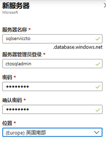
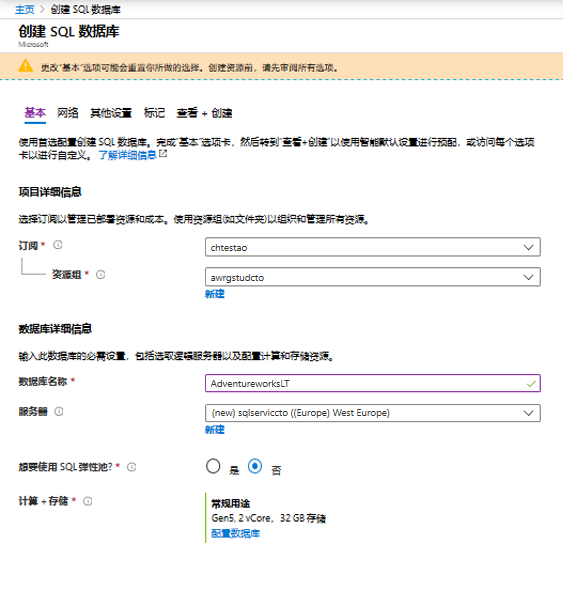
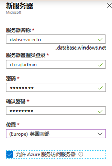
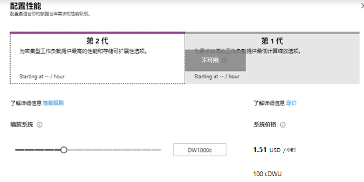
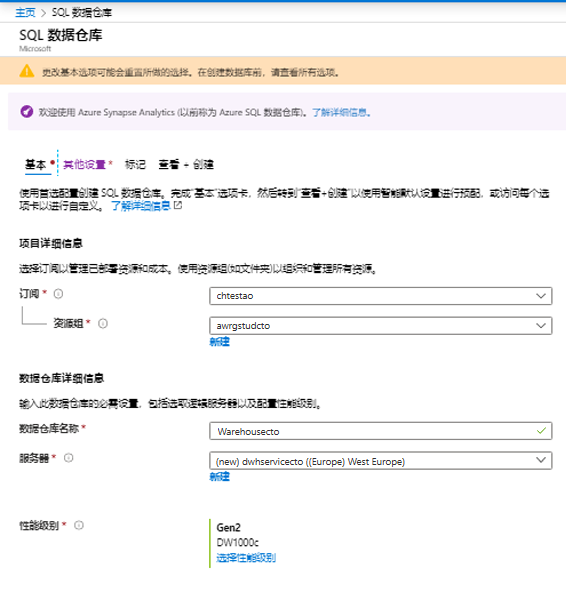
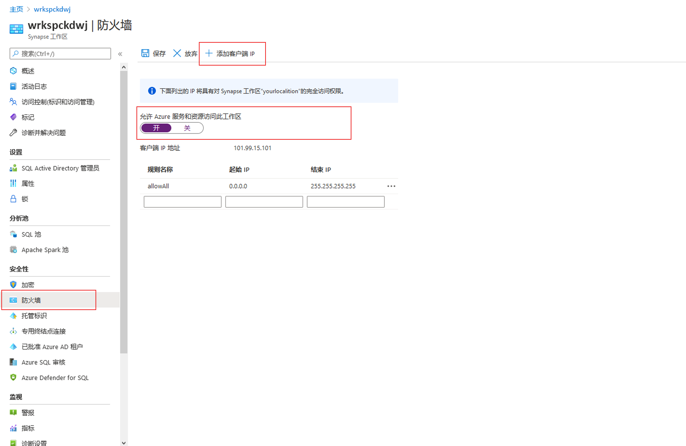

---
lab:
    title: '在云中使用关系数据存储'
    module: '模块 5:使用云中的关系数据存储'
---

# DP 200 - 实施数据平台解决方案
# 实验 5 - 在云中使用关系数据存储

**预计用时**：75 分钟

**先决条件**：假设已阅读了本实验室的案例研究。假设模块 1 的内容和实验室：“适用于数据工程师的 Azure”中的内容也已完成

**实验室文件**：本实验室文件位于 _Allfiles\Labfiles\Starter\DP-200.5_ 文件夹。

## 实验室概述

学生将能够预配 Azure SQL 数据库和 Azure Synapse Analytics，并能够对其中一个已创建的实例发起查询。他们还能够集成 SQL 数据仓库以及其他数据平台技术，并使用 PolyBase 将数据从数据源加载到 Azure Synapse Analytics 中。

## 实验目标
  
完成这个实验后，你将能够：

1. 使用 Azure SQL 数据库
1. 描述 Azure Synapse Analytics 
1. 创建和查询 Azure Synapse Analytics 
1. 使用 PolyBase 将数据加载到 Azure Synapse Analytics 中 

## 情景
  
你是 AdventureWorks 的高级数据工程师，并且你正在与团队合作将关系数据库系统从本地 SQL Server 转换到 Azure 中的 Azure SQL 数据库。首先，使用公司的示例数据库创建 Azure SQL 数据库实例。你想要将此实例交给初级数据工程师来执行部门数据库的一些测试。

然后，你将预配 Azure Synapse Analytics 服务器，并通过使用一系列查询测试示例数据库来测试服务器的预配是否成功。然后，你将使用 PolyBase 从 Azure Blob 加载维度表，以测试这些数据平台技术与 Azure Synapse Analytics 的集成情况。

在本实验室课程结束时，你将学习：

1. 使用 Azure SQL 数据库
1. 描述 Azure Synapse Analytics 
1. 创建并查询 Azure Synapse Analytics 
1. 使用 PolyBase 将数据加载到 Azure Synapse Analytics 

> **重要事项**：在完成本实验课程的过程中，请使用位于 _\Labfiles\DP-200-Issues-Doc.docx_ 的文档表格记录你在任何预配或配置任务中遇到的任何问题。记录实验室编号，记录技术，说明问题以及解决方案。保存该文档，以便在之后的模块中参考。

## 练习 1：使用 Azure SQL 数据库

预计用时：15 分钟

个人练习
  
本练习的主要任务如下：

1. 创建和配置 SQL 数据库实例。

### 任务 1：创建和配置 SQL 数据库实例。

1. 在 Azure 门户中，导航到 **“+ 创建资源”** 边栏选项卡。

1. 在新屏幕中，单击 **“搜索市场”** 文本框，然后输入 **“SQL 数据库”**。在显示的列表中单击 **“SQL 数据库”**。

1. 在 **“SQL 数据库”** 屏幕中，单击 **“创建”**。

1. 在 **“创建 SQL 数据库”** 屏幕中，使用以下设置创建 Azure SQL 数据库：

    - 在“项目详细信息”部分，键入以下信息：
    
        - **订阅**：你在本实验室使用的订阅名称

        - **资源组**： **awrgstudxx**，其中 **xx** 是你的首字母缩写。

    - 单击 **“其他设置”** 选项卡，单击 **“示例”** 。自动选择 AdventureworksLT 示例数据库。 
    
    - 完成后，单击 **“基本信息”** 选项卡。
    
    - 在数据库详情部分中，键入以下信息：
    
        - 数据库名称：输入 **AdventureworksLT**
     
        - 服务器：执行以下步骤创建新的服务器：单击 **“新建”**，进行以下设置，然后单击 **“确定”**。
            - **服务器名称**： **sqlservicexx**，其中 **xx** 是你的首字母缩写
            - **服务器管理员登录**： **xxsqladmin**，其中 **XX** 是你的姓名首字母缩写
            - **密码**：**Pa55w.rd**
            - **确认密码**：**Pa55w.rd**
            - **位置**：选择一个靠近你的 **位置**。
            - 单击 **“确定”**。

                

            - 将其他设置保留为默认值并单击 **“确认”**。
            

    

1. 在 **“创建 SQL 数据库”** 边栏选项卡中，单击 **“查看+创建”**。

1. 在验证 **“创建 SQL 数据库”*** 边栏选项卡后，单击 **“创建”**。

   > **注意**：该预配大约需要 4 分钟。

> **结果**：完成本练习后，你会有一个 SQL 数据库实例

## 练习 2：描述 Azure Synapse Analytics
  
预计用时：15 分钟

个人练习
  
本练习的主要任务如下：

1. 创建并配置 Azure Synapse Analytics 实例。

1. 配置服务器防火墙

1. 暂停仓库数据库

### 任务 1：创建并配置 Azure Synapse Analytics 实例。

1. 在 Azure 门户中，单击萤幕左上角的 **主页** 链接。

1. 在 Azure 门户中，单击 **“+ 创建资源”**。

1. 在新的边栏选项卡中，导航到 **“搜索市场”** 文本框，然后输入单词 **“Cosmos”**。在显示的列表中单击 **“Azure Synapse Analytics （原来的 SQL DW）”**。

1. 在 **“Azure Cosmos SQL （前称 SQL DW）”** 边栏选项卡中，单击 **“创建”**。

1. 从 **“SQL 数据仓库”** 边栏选项卡使用以下设置创建 Azure Synapse Analytics：

    - 在“项目详细信息”部分，键入以下信息：

        - **订阅**：你在本实验室使用的订阅名称

        - **资源组**： **awrgstudxx**，其中 **xx** 是你的首字母缩写。

    - 在数据源下的 **“附加设置”** 选项卡中单击 **“示例”**。

    - 完成后，单击 **“基本信息”** 选项卡。
    
    - 在数据库详情部分中，键入以下信息：

        - **数据库仓库名称**： **Warehousexx**，其中 **“XX”** 是你的姓名首字母缩写。

        - **服务器**：通过单击 **“新建”**，并进行以下设置创建新的服务器，然后单击 **“确定”**：
            - **服务器名称**： **dwhservicexx**，其中 **xx** 是你的首字母缩写
            - **服务器管理员登录**： **xxsqladmin**，其中 **XX** 是你的姓名首字母缩写
            - **密码**： **Pa55w.rd**
            - **确认密码**： **Pa55w.rd**
            - **位置**：选择一个靠近你的 **位置**。
            - 选中复选框以允许 Azure 服务访问服务器
            - 单击 **“确定”**。

                

    - 性能级别：请单击 **“选择性能级别”**，然后选择 **Gen2 DW100C**。

        

    - 请单击 **“应用”**，将显示以下配置。

        

1. 在 **“SQL 数据仓库”** 屏幕中，单击 **“查看 + 创建”**。

1. 在 **“SQL 数据仓库”** 边栏选项卡中单击 **“创建”**。

   > **注意**：此配置大约需要 7 分钟。

### 任务 2：配置服务器防火墙

1. 在 Azure 门户的边栏选项卡中，单击 **“资源组”**，然后单击 **“awrgstudxx”**，再单击 **“awdlsstudxx”**，其中 **xx** 是你的姓名首字母缩写

1. 单击 **dwhservicexx**，其中 **xx** 是你的姓名首字母缩写。

1. 在 **“sqlservicexx”** 屏幕中，单击 **“防火墙和虚拟网络”**。

1. 在 dwhservicexx - 防火墙和虚拟网络屏幕中，单击 **“+添加客户端 IP”** 选项，然后单击 **“保存”**。在成功屏幕上，单击 **“确定”**。

    

    > **注意**：你会收到一条消息，告知已成功更新服务器防火墙规则

1. 关闭“防火墙和虚拟网络”屏幕。

> **结果**：完成此练习后，你会创建一个 Azure Synapse Analytics 实例，并将服务器防火墙配置为启用与该实例的连接。

### 任务 3：暂停 Warehousexx 数据库

1. 单击 **Warehousexx**，其中 **xx** 是你的姓名首字母缩写。

1. 在 **Warehousexx (dwhservicexx/Warehousexx)** 屏幕上单击 **“暂停”**。

1. 在“暂停 Warehousexx”屏幕中，单击 **“是”**


## 练习 3：创建 Azure Synapse Analytics 数据库和表格

预计用时：25 分钟

个人练习

本练习的主要任务如下：

1. 安装 SQL Server Management Studio 并连接到数据仓库实例。

1. 创建 SQL 数据仓库数据库

1. 创建 SQL 数据仓库表格

    > **注意**：如果你不熟悉 Transact-SQL，则可参考位于 **Allfiles\Labfiles\Starter\DP-200.5\SQL DW Files** 中有关以下实验室的说明

### 任务1：安装 SQL Server Management Studio 并连接到 SQL 数据仓库实例。

1. 在 Azure 门户的 **dwhservicexx - 防火墙和虚拟网络** 的边栏选项卡中，单击 **“属性”**

1. 复制 **“服务器名称”** 并将其粘贴到记事本中。

1. 下载 [SQL Server Management Studio](https://docs.microsoft.com/zh-cn/sql/ssms/download-sql-server-management-studio-ssms?view=sql-server-2017) 并安装到你的计算机上

1. 在 Windows 桌面版上，单击 **“开始”**，并输入 **“SQL 服务器”**，然后单击 **“MIcrosoft SQL Server Management Studio 17”**

1. 在 **“连接到服务器”** 对话框中，填写以下详细信息
    - 服务器名： **sqlservicexx.database.windows.net**
    - 身份验证： **SQL 服务器身份验证**
    - 用户名： **xxsqladmin**
    - 密码： **Pa55w.rd**

1. 在 **“连接到服务器”** 对话框中，单击 **“连接”**。 

### 任务 2：创建 SQL 数据仓库数据库。

1. 在 **“SQL Server Management Studio”** 的“对象资源管理器”中，右键单击 **“sqlservicexx.database.windows.net”**，并单击 **“新查询”**。 

1. 在查询窗口中，创建一个名为 **DWDB** 的数据仓库数据库，服务目标为 DW100，最大容量为 1024GB。

    ```SQL
    CREATE DATABASE DWDB COLLATE SQL_Latin1_General_CP1_CI_AS
    （
        EDITION             = 'DataWarehouse'
    ,   SERVICE_OBJECTIVE   = 'DW100C'
    ,   MAXSIZE             = 1024 GB
    );
    ```

    > **注意**：创建数据库大约需要 2 分钟。


### 任务 3：创建 SQL 数据仓库表。

1. 在 **“SQL Server Management Studio”** 的“对象资源管理器”中，右键单击 **“sqlservicexx.database.windows.net”**，并单击 **“新查询”**。

1. 在 **SQL Server Management Studio** 的 SQL 编辑器工具栏中，找到 **可用的数据库**，单击 **DWDB**。

    >**注意**：如果你不熟悉 Transact-SQL，请参考 Allfiles\Solution\DP-200.5\folder 中名为 **Exercise3 Task3Step2 script.sql** 的脚本。它包含创建表所需的大部分代码，但是你必须通过选择要用于每个表的分发类型来完成代码 

1. 创建名为 **dbo.Users**、具有 **“群集列存储”** 索引的表，此索引为 **副本**分布，并有以下列：

    | 列名 | 数据类型 | 为 Null 性|
    |-------------|-----------|------------|
    | userId | int | NULL|
    | 市 | nvarchar(100) | NULL|
    | 区域 | nvarchar(100) | NULL|
    | 国家/地区 | nvarchar(100) | NULL|

1. 在 **SQL Server Management Studio** 中，单击 **“执行”**。

1. 在 **“SQL Server Management Studio”** 的“对象资源管理器”中，右键单击 **“sqlservicexx.database.windows.net”**，并单击 **“新查询”**。

1. 在 **SQL Server Management Studio** 的 SQL 编辑器工具栏中，找到 **可用的数据库**，单击 **DWDB**。

1. 使用 **“群集列存储”** 索引创建名为 **“dbo.Products”** 的表，此索引为 **“轮循机制”** 分布，含有以下列：

    | 列名 | 数据类型 | 为 Null 性|
    |-------------|-----------|------------|
    | ProductId | int | NULL|
    | EnglishProductName | nvarchar(100) | NULL|
    | 颜色 | nvarchar(100) | NULL|
    | StandardCost | int | NULL|
    | ListPrice | int | NULL|
    | 大小 | nvarchar(100) | NULL|
    | 权重 | int | NULL|
    | DaysToManufacture | int | NULL|
    | 类 | nvarchar(100) | NULL|
    | 样式 | nvarchar(100) | NULL|

1. 在 **SQL Server Management Studio** 中，单击 **“执行”**。

1. 在 **“SQL Server Management Studio”** 的“对象资源管理器”中，右键单击 **“sqlservicexx.database.windows.net”**，并单击 **“新查询”**。

1. 在 **SQL Server Management Studio** 的 SQL 编辑器工具栏中，找到 **可用的数据库**，单击 **DWDB**。

1. 使用 **聚集列存储** 索引创建名为 **dbo.FactSales** 的表，此索引在 **SalesUnit** 上为 **哈希** 分布，含有以下列：

    | 列名 | 数据类型 | 为 Null 性|
    |-------------|-----------|------------|
    | DateId | int | NULL|
    | ProductId | int | NULL|
    | UserId | int | NULL|
    | UserPreferenceId | int | NULL|
    | SalesUnit | int | NULL|

1. 在 **SQL Server Management Studio** 中单击 **“执行”**。

> **结果**：完成本练习后，你已安装 SQL Server Management Studio，创建了一个名为 DWDB 的数据仓库以及三个分别为“Users”、“Products”和“FactSales”的表。

## 练习 4：使用 PolyBase 将数据加载到 Azure Synapse Analytics 

预计时间：10 分钟

个人练习

本练习的主要任务如下：

1. 收集 Data Lake Storage 容器及密钥详情

1. 使用 Azure Data Lake Storage 中的 PolyBase 创建 dbo.Dates 表

### 任务 1：收集 Azure  Blob 帐户名称和密钥详情

1. 在 Azure 门户中，单击 **“资源组”**，然后单击 **“awrgstudxx”**，再单击 **“awdbwsstudxx”**，其中“xx”是你的姓名首字母缩写。

1. 在 **“awsastudxx”** 屏幕中单击 **“访问密钥”**。单击 **“存储帐户名称”** 旁边的图标并将其粘贴到记事本中。

1. 在 **“awdlsstudxx - 访问密钥”** 屏幕中的 **“密钥 1”** 下，单击 **“密钥”** 旁边的图标并将其粘贴到记事本中。

### 任务 2：使用 Azure Blob 中的 PolyBase 创建 dbo.Dates 表

1. 在 **“SQL Server Management Studio”** 的“对象资源管理器”中，右键单击 **“sqlservicexx.database.windows.net”**，并单击 **“新查询”**。

1. 在 **SQL Server Management Studio** 的 SQL 编辑器工具栏中，找到 **可用的数据库**，单击 **DWDB**。

1. 为 **DWDB** 数据库创建 **主密钥**。在查询编辑器中键入以下代码：

    ```SQL
    CREATE MASTER KEY;
    ```

1. 输入以下代码，根据以下详情创建名为 **AzureStorageCredential** 的数据库范围的凭据：
    - IDENTITY: **MOCID**
    - SECRET: **存储帐户的访问密钥**

    ```SQL
    CREATE DATABASE SCOPED CREDENTIAL AzureStorageCredential
    WITH
    IDENTITY = 'MOCID',
    SECRET = 'Your storage account key'
;
    ```

1. 在 **SQL Server Management Studio** 中突出显示两个语句，然后单击 **“执行”**。

1. 在 **SQL Server Management Studio** 中的“查询”窗口中，输入用来为 Blob 存储帐户创建名为 **AzureStorage** 的外部数据源的代码，以及使用 **HADOOP** 类型创建并使用 ****AzureStorageCredential** 的数据容器。请注意，你应该将位置密钥中的 **awdlsstudxx** 替换为带有你姓名缩写的存储帐户 

    ```SQL
	CREATE EXTERNAL DATA SOURCE AzureStorage
    WITH (
        TYPE = HADOOP,
        LOCATION = 'abfs://data@awdlsstudxx.dfs.core.windows.net',
        CREDENTIAL = AzureStorageCredential
    );
    ```

1. 在 **SQL Server Management Studio** 的“查询”窗口中，键入用来创建名为 **TextFile** 的外部文件格式的代码，格式类型为**DelimitedText**，字段终止符为 **“逗号”**。

    ```SQL
    CREATE EXTERNAL FILE FORMAT TextFile
    WITH (
        FORMAT_TYPE = DelimitedText,
        FORMAT_OPTIONS (FIELD_TERMINATOR = ',')
    );
    ```

1. 在 **SQL Server Management Studio** 中，突出显示该语句，然后单击**“执行”**。

1. 在 **“SQL Server Management Studio”** 的查询窗口中，输入用来创建名为 **dbo.DimDate2External** 外部表格的代码，其中以 **位置** 作为根文件，数据源为 **AzureStorage**， **TextFile** 的 File_format 含以下列：

    | 列名 | 数据类型 | 为 Null 性|
    |-------------|-----------|------------|
    | Date | datetime2(3) | NULL|
    | DateKey | decimal(38, 0) | NULL|
    | MonthKey | decimal(38, 0) | NULL|
    | Month | nvarchar(100) | NULL|
    | 季度 | nvarchar(100) | NULL|
    | 年份 | decimal(38, 0) | NULL|
    | 年 - 季度 | nvarchar(100) | NULL|
    | Year-Month | nvarchar(100) | NULL|
    | Year-MonthKey | nvarchar(100) | NULL|
    | WeekDayKey| decimal(38, 0) | NULL|
    | WeekDay| nvarchar(100) | NULL|
    | 日期| decimal(38, 0) | NULL|

    ```SQL
	CREATE EXTERNAL TABLE dbo.DimDate2External (
    [Date] datetime2(3) NULL,
    [DateKey] decimal(38, 0) NULL,
    [MonthKey] decimal(38, 0) NULL,
    [Month] nvarchar(100) NULL,
    [Quarter] nvarchar(100) NULL,
    [Year] decimal(38, 0) NULL,
    [Year-Quarter] nvarchar(100) NULL,
    [Year-Month] nvarchar(100) NULL,
    [Year-MonthKey] nvarchar(100) NULL,
    [WeekDayKey] decimal(38, 0) NULL,
    [WeekDay] nvarchar(100) NULL,
    [Day Of Month] decimal(38, 0) NULL
    )
    WITH (
        location='DimDate2.txt'
        DATA_SOURCE=AzureStorage,
        FILE_FORMAT=TextFile
    );
    ```

1. 在 **SQL Server Management Studio** 中，突出显示该语句，然后单击 **“执行”**。

1. 测试是否通过对表格运行 select 语句来创建表格

    ```SQL
    SELECT * FROM dbo.DimDate2External;
    ```

1. 在 **SQL Server Management Studio** 的“查询”窗口中，输入 **CTAS** 语句，用于创建一个名为 **dbo.Dates** 的表，该表包 **含列存储** 索引以及从 **dbo.DimDate2External** 表加载数据的**轮训机制** **分发**。

    ```SQL
    CREATE TABLE dbo.Dates
    WITH
    （   
        CLUSTERED COLUMNSTORE INDEX,
        DISTRIBUTION = ROUND_ROBIN
    )
    AS
    SELECT * FROM [dbo].[DimDate2External];
    ```

1. 在 **SQL Server Management Studio** 中突出显示该语句，然后单击 **“执行”**。
 
1. 在 **SQL Server Management Studio** 的“查询”窗口中，输入一项针对 **DateKey**、 **Quarter** 和 **Month** 列生成统计信息的查询。

    ```SQL
    CREATE STATISTICS [DateKey] on [Dates] ([DateKey]);
    CREATE STATISTICS [Quarter] on [Dates] ([Quarter]);
    CREATE STATISTICS [Month] on [Dates] ([Month]);
    ```

1. 通过运行选择语句对已创建表格进行测试。

    ```SQL
    SELECT * FROM dbo.Dates;
    ```


