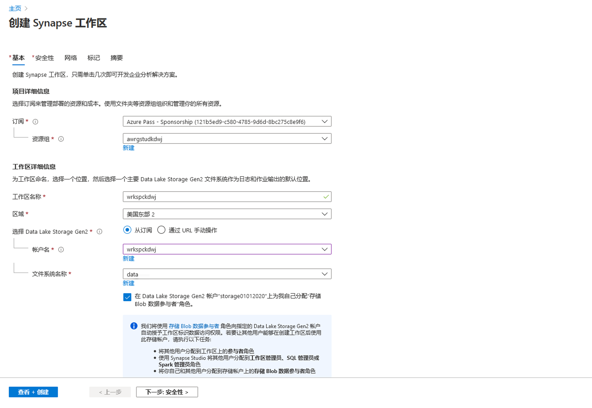
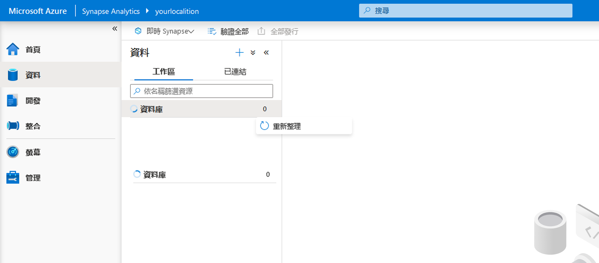

# DP 200 - 实施数据平台解决方案
# 实验室 5 - 在云中使用关系数据存储

**预计用时**：75 分钟

**先决条件**：假设已阅读了本实验室的案例研究。假设模块 1 的内容和实验：数据工程师的 Azure 也已完成

**实验室文件**：本实验室文件位于 Allfiles\Labfiles\Starter\DP-200.5__ 文件夹。

## 实验室概述

学生将能够预配 Azure SQL 数据库和 Azure Synapse Analytics，并能够对其中一个已创建的实例发起查询。他们还能够集成 SQL 数据仓库以及其他数据平台技术，并使用 PolyBase 将数据从数据源加载到 Azure Synapse Analytics 中。

## 实验室目标
  
完成本实验室后，你将能够：

1. 使用 Azure SQL 数据库
2. 描述 Azure Synapse Analytics 
3. 创建和查询 Azure Synapse Analytics 
4. 使用 PolyBase 将数据加载到 Azure Synapse Analytics 中 

## 场景
  
你是 AdventureWorks 的高级数据工程师，并且你正在与团队合作将关系数据库系统从本地 SQL Server 转换到 Azure 中的 Azure SQL 数据库。首先，使用公司的示例数据库创建 Azure SQL 数据库实例。你想要将此实例交给初级数据工程师来执行部门数据库的一些测试。

然后，你将预配 Azure Synapse Analytics 服务器，并通过使用一系列查询测试示例数据库来测试服务器的预配是否成功。然后，你将使用 PolyBase 从 Azure Blob 加载维度表，以测试这些数据平台技术与 Azure Synapse Analytics 的集成情况。

在本实验室课程结束时，你将能够：

1. 使用 Azure SQL 数据库
2. 描述 Azure Synapse Analytics 
3. 创建并查询 Azure Synapse Analytics 
4. 使用 PolyBase 将数据加载到 Azure Synapse Analytics 

> **重要事项**：在完成本实验室课程时，请记下你在任何设置或配置任务中遇到的任何问题，并将其记录在位于 \Labfiles\DP-200-Issues-Doc.docx__ 的文档的表格中。记录实验室编号，记录技术，说明问题以及解决方案的内容。保存该文档，以便在稍后的模块中参考它。

## 练习 1：使用 Azure SQL 数据库

预计用时：15 分钟

个人练习
  
本练习的主要任务如下：

1. 创建和配置 SQL 数据库实例。

### 任务 1：创建和配置 SQL 数据库实例。

1. 在Azure门户中，导航到**创建资源**边栏选项卡。

2. 在新屏幕中，单击 **“搜索市场”** 文本框，然后输入 **“SQL 数据库”**。在显示的列表中单击 **“SQL 数据库”**。

3. 在 **“SQL 数据库”** 屏幕中，单击 **“创建”**。

4. 在 **“创建 SQL 数据库”** 屏幕中，使用以下设置创建 Azure SQL 数据库：

    - 在“项目详细信息”部分，键入以下信息：
    
        - **订阅**：你用于本实验室的订阅名称

        - **资源组**：**awrgstudxx**，其中 **xx** 是你的姓名缩写。

    - 单击 **“其他设置”** 选项卡，单击 **“示例”**。自动选择 AdventureworksLT 示例数据库。 
    
    - 完成后，单击 **“基本信息”** 选项卡。
    
    - 在数据库详情部分中，键入以下信息：
    
        - 数据库名称：输入 **AdventureworksLT**
     
        - 服务器：通过单击 **“新建”**，以及进行以下设置，来创建新的服务器，然后单击 **“确定”**：
            - **服务器名称**：**sqlservicexx**，其中 **xx** 是你的首字母缩写
            - **服务器管理员登录名**：**xxsqladmin**，其中**XX**是你的姓名首字母缩写
            - **密码**：**Pa55w.rd**
            - **确认密码**：**Pa55w.rd**
            - **位置**：选择一个靠近你的 **位置**。
            - 单击 **“确定”**。

                

            - 将其他设置保留为默认值并单击 **“确认”**。
            

    

5. 在 **“创建 SQL 数据库”** 边栏选项卡中，单击 **“查看+创建”**。

6. 验证 **“创建 SQL 数据库”** 边栏选项卡后，单击**“创建”***。

   > **备注**：预配大约需要 4 分钟。

> **结果**：完成本练习后，你将拥有Azure SQL数据库实例

## 练习 2：描述 Azure Synapse Analytics
  
预计用时：15 分钟

个人练习
  
本次练习的主要任务如下：

1. 创建并配置 Azure Synapse Analytics 实例。

2. 配置服务器防火墙

3. 暂停仓库数据库

### 任务 1：创建并配置 Azure Synapse Analytics 实例。

1. 在 Azure 门户中，单击屏幕左上角的 **“主页”** 链接。

2. 在 Azure 门户中，单击 **“+ 创建资源”**。

3. 在新的边栏选项卡中，导航到 **“搜索市场”** 文本框，然后输入单词 **“Cosmos”**。在显示的列表中单击 **“Azure Synapse Analytics”**。

4. 在 **“Azure Synapse Analytics”** 边栏选项卡中，单击 **“创建”**。

5. 从 **“创建 Synapse 工作区”**、**“基本信息”** 边栏选项卡中，创建 Azure Synapse Analytics 工作区，使其包含以下设置：

    - 在“项目详细信息”部分，键入以下信息：

        - **订阅**：你用于本实验室的订阅名称

        - **资源组**：**awrgstudxx**，其中 **xx** 是你的姓名缩写。

    - 在“工作区详细信息”部分，使用以下设置创建工作区：
        
        - **工作区名称**：**wrkspcxx**，其中 **xx** 是你的姓名缩写。
        - **区域**：选择距离你最近并且你在其中部署了资源组的区域
        - **选择 Data Lake Storage Gen2**：“来自订阅”
        - **帐户名称**：选择 **awdlsstudxx**，其中 **xx** 是你的姓名缩写
        - **文件系统名称**：选择 **“数据”**
        - **选中**“向我自己分配 Data Lake Storage Gen2 帐户 'awdlsstudxx' 的存储 Blob 数据参与者角色” 

         

    - 导航到 **“创建 Synapse 工作区”** 边栏选项卡中的 **“安全”** 选项卡。 

    - 在“SQL 管理员凭据”部分下，提供以下内容：
        - **密码**：**Pa55w.rd**
        - **确认密码**：**Pa55w.rd**
        - 将其他所有设置保留为**默认值**。 

    - 在屏幕中，单击 **“查看 + 创建”**。
    - 在边栏选项卡中，单击 **“创建”**。

   > **备注**：预配大约需要 7 分钟。

6. 预配完成后，选择 **“前往资源”**，你将登陆 Azure Synapse Analytics 工作区的 **“概述”** 页面。  

7. 选择 **“+ 新建专用 SQL 池”**。

8.在 **“创建专用 SQL 池”** 边栏选项卡的 **“基本信息”** 页面，配置以下设置：
        - 专用 SQL 池名称：**dedsqlxx**，其中 **xx** 是你的姓名缩写
        - 将其他所有设置保留为默认值

9. 在 **“创建专用 SQL 池”** 屏幕中，单击 **“查看 + 创建”**。

10. 在 **“创建专用 SQL 池”** 边栏选项卡中，单击 **“创建”**。
  

   > **备注**：预配大约需要 7 分钟。

### 任务 2：配置服务器防火墙

1. 在 Azure 门户的边栏选项卡中，单击 **“资源组”**，然后单击 **“awrgstudxx”**，再单击 **“wrkspcxx”**，其中 **xx** 是你的姓名缩写

2. 在 **wrkspcxx** 屏幕中，单击 **“防火墙”**。

3. 在 **“wrkspcxx** - 防火墙”屏幕中，单击选项 **“+ 添加客户端 IP”**，并检查 **“允许 Azure 服务和资源访问此工作区”** 设置为 **“打开”**，然后单击 **“保存”**。在成功屏幕上，单击 **“确定”**。

    

    > **备注**：你将收到一条消息，指出服务器防火墙规则已成功更新

4. 关闭“防火墙”屏幕。

> **结果**：完成此练习后，你会创建一个 Azure Synapse Analytics 实例，并将服务器防火墙配置为启用与该实例的连接。

### 任务 3：暂停 **dedsqlxx** 专用 SQL 池

1. 导航到资源组中的 **dedsqlxx** 资源。 

2. 单击 **dedsqlxx**，其中 **xx** 是你的姓名缩写。

3. 在 **dedsqlkxx (wrkspcxx/dedsqlxx)** 屏幕上单击 **“暂停”**。

4. 在“暂停 **dedsqlxx”** 屏幕中，单击 **“是”**


## 练习 3：创建 Azure Synapse Analytics 数据库和表格

预计用时：25 分钟

个人练习

本次练习的主要任务如下：

1. 了解 Synapse Studio 并连接到专用 SQL 池。

2. 创建专用 SQL 池数据库

3. 创建专用 SQL 池表

    > **备注**：如果你不熟悉 Transact-SQL，则以下位置的说明可用于以下实验 **Allfiles\Labfiles\Starter\DP-200.5\SQL DW Files**

### 任务 1：将专用 SQL 池连接到 Azure Synapse Studio

1. 导航到资源组中的 **dedsqlxx** 资源。 

2. 在 **“概述”** 部分中，导航到 **“启动 Synapse Studio”**

3. 单击屏幕左侧的 **“数据中心”**

4. 打开 **dedsqlxx** 池 

5. 选择 **dedsqlxx** 池旁边的 Eclipse。 

6. 选择 **“新 SQL 脚本”** 和 **“空脚本”**

    


7. 在查询窗口中，粘贴以下查询，该查询创建一个名为 **DWDB** 的数据库，服务目标为 DW100，最大容量为 1024GB。

    ```SQL
    CREATE DATABASE DWDB COLLATE SQL_Latin1_General_CP1_CI_AS
    (
        EDITION             = 'DataWarehouse'
    ,   SERVICE_OBJECTIVE   = 'DW100C'
    ,   MAXSIZE             = 1024 GB
    );
    ```

8. 导航到 **“使用数据库”**，然后选择 **“主数据库”**。 

9. 单击 **“运行”** 

 > **备注**：创建数据库大约需要 6 分钟。

10. 查询完成后，单击“刷新”，并在打开 Eclipse 时导航到 **“数据库”** 下新创建的数据库。


### 任务 3：创建专用 SQL 池表。

1. 在 Synapse Studio 中，在“数据中心”选项卡中打开 Eclipse 时，导航到 **“数据库”** 下新创建的 **数据库**。单击 **“DWDB”**。

2. 选择 **DWDB** 数据库旁边的 Eclipse。

3. 选择 **“新 SQL 脚本”** 和 **“空脚本”**

    >**备注**：如果你不熟悉 Transact-SQL，则在 Allfiles\Solution\DP-200.5\folder 下有一个脚本名为 **Exercise3 Task3Step2 script.sql** 的脚本。它包含创建表所需的大部分代码，但是你必须通过选择要用于每个表的分配类型来完成代码 

4. 创建一个名为 **dbo.Users** 的表，其具有 **聚集列存储** 索引，此索引为 **复制** 分布，具有以下列：

    | 列名 | 数据类型 | 可为空性|
    |-------------|-----------|------------|
    | 用户Id | int | 空|
    | 市 | nvarchar(100) | 空|
    | 区域 | nvarchar(100) | 空|
    | 国家/地区 | nvarchar(100) | 空|

      >**备注**：请确保脚本已连接到 **DWDB** 并使用数据库 **DWDB**。 


5. 在 **Synapse Studio** 中，单击 **“运行”**，即可执行查询。要验证是否已创建 **dbo.Users** 表，可以单击“刷新”并导航到 **“表”**，对其进行展开即可显示表。 

6. 在 Synapse Studio 中，在“数据中心”选项卡中打开 Eclipse 时，导航到 **“数据库”** 下新创建的 **数据库**。单击 **“DWDB”**。

7. 选择 **DWDB** 数据库旁边的 Eclipse。

8. 选择 **“新 SQL 脚本”** 和 **“空脚本”**

9. 创建一个名为 **dbo.Products** 的表，其具有 **聚集列存储** 索引，此索引为 **轮循机制** 分布，具有以下列：

    | 列名 | 数据类型 | 可为空性|
    |-------------|-----------|------------|
    | 产品Id | int | 空|
    | 英文产品名称 | nvarchar(100) | 空|
    | 颜色 | nvarchar(100) | 空|
    | 标准费用 | int | 空|
    | ListPrice | int | 空|
    | 大小 | nvarchar(100) | 空|
    | 重量 | int | 空|
    | 制造日 | int | 空|
    | 类 | nvarchar(100) | 空|
    | 类型 | nvarchar(100) | 空|

    >**备注**：请确保脚本已连接到 **DWDB** 并使用数据库 **DWDB**。 

10. 在 **Synapse Studio** 中，单击 **“运行”**，即可执行查询。要验证是否已创建 **dbo.Products** 表，可以单击“刷新”并导航到 **“表”**，对其进行展开即可显示表。 

11. 在 Synapse Studio 中，在“数据中心”选项卡中打开 Eclipse 时，导航到 **“数据库”** 下新创建的 **数据库**。单击 **“DWDB”**。

12. 选择 **DWDB** 数据库旁边的 Eclipse。

13. 选择 **“新 SQL 脚本”** 和 **“空脚本”**

14. 创建一个名为 **dbo.FactSales** 的表，其具有 **“聚集列存储”** 索引，此索引在 **“销量单位”** 上为 **哈希** 分布，具有以下列：

    | 列名 | 数据类型 | 可为空性|
    |-------------|-----------|------------|
    | 日期Id | int | 空|
    | 产品Id | int | 空|
    | 用户Id | int | 空|
    | 用户参考Id | int | 空|
    | 销售单位 | int | 空|

    >**备注**：请确保脚本已连接到 **DWDB** 并使用数据库 **DWDB**。 

15. 在 **Synapse Studio** 中，单击 **“运行”**，即可执行查询。要验证是否已创建 **dbo.FactSales** 表，可以单击“刷新”并导航到 **“表”**，对其进行展开即可显示表。 

> **结果**：完成本练习后，你已使用 Synapse Studio 创建了一个名为 DWDB 的数据仓库和名为“Users”、“Products”和“FactSales”的三个表。

## 练习 4：使用 PolyBase 将数据加载到 Azure Synapse Analytics 

预计用时：10 分钟

个人练习

本次练习的主要任务如下：

1. 收集 Data Lake Storage 容器及密钥详情

2. 使用 Azure Data Lake Storage 中的 PolyBase 创建 dbo.Dates 表

### 任务 1：收集Azure Blob帐户名称和密钥详情

1. 在 Azure 门户中，单击 **“资源组”**，然后单击 **“awrgstudxx”**，再单击 **“awdbwsstudxx”**，其中“xx”是你的姓名首字母缩写。

2. 在 **“awsastudxx”** 屏幕中单击 **“访问密钥”**。单击 **“存储帐户名称”** 旁边的图标并将其粘贴到记事本中。

3. 在 **“awdlsstudxx - 访问密钥”** 屏幕中的 **“key1”** 下，单击 **“密钥”** 旁边的图标并将其粘贴到记事本中。

### 任务 2：使用 Azure Blob 中的 PolyBase 创建 dbo.Dates 表

1. 在 Synapse Studio 中，在“数据中心”选项卡中打开 Eclipse 时，导航到 **“数据库”** 下新创建的 **数据库**。单击 **“DWDB”**。

2. 选择 **DWDB** 数据库旁边的 Eclipse。

3. 选择 **“新 SQL 脚本”** 和 **“空脚本”**

4. 创建一个 **“主密钥”**，保护 **DWDB** 数据库。在查询编辑器中键入以下代码：

    ```SQL
    CREATE MASTER KEY;
    ```
    >**注意**：请确保脚本已连接到 **DWDB** 并使用数据库 **DWDB**。 

5. 在 **Synapse Studio** 中，单击 **“运行”**，即可执行查询。

6. 在 Synapse Studio 中，在“数据中心”选项卡中打开 Eclipse 时，导航到 **“数据库”** 下新创建的 **数据库**。单击 **“DWDB”**。

7. 选择 **DWDB** 数据库旁边的 Eclipse。

8. 选择 **“新 SQL 脚本”** 和 **“空脚本”**

9. 在查询编辑器中输入以下代码，根据以下详情创建名为 **AzureStorageCredential** 的数据库范围的凭据：
    - 标识：**MOCID**
    - 机密：**存储帐户的访问密钥**

    ```SQL
    CREATE DATABASE SCOPED CREDENTIAL AzureStorageCredential
    WITH
    IDENTITY = 'MOCID',
    SECRET = 'Your storage account key'
;
    ```
    >**注意**：请确保脚本已连接到 **DWDB** 并使用数据库 **DWDB**。 

10. 在 **Synapse Studio** 中，单击 **“运行”**，即可执行查询。

11. 在 Synapse Studio 中，在“数据中心”选项卡中打开 Eclipse 时，导航到 **“数据库”** 下新创建的 **数据库**。单击 **“DWDB”**。

12. 选择 **DWDB** 数据库旁边的 Eclipse。

13. 选择 **“新 SQL 脚本”** 和 **“空脚本”**

14. 在“查询”窗口中，输入用来为 Blob 存储帐户创建名为 **AzureStorage** 的外部数据源的代码，以及使用 **HADOOP** 类型创建并使用 **AzureStorageCredential** 的数据容器。请注意，你应该将位置密钥中的 **awdlsstudxx** 替换为带有你姓名缩写的存储帐户 

    ```SQL
	CREATE EXTERNAL DATA SOURCE AzureStorage
    WITH (
        TYPE = HADOOP,
        LOCATION = 'abfs://data@awdlsstudxx.dfs.core.windows.net',
        CREDENTIAL = AzureStorageCredential
    );
    ```
    >**注意**：请确保脚本已连接到 **DWDB** 并使用数据库 **DWDB**。 

15. 在 **Synapse Studio** 中，单击 **“运行”**，即可执行查询。

16. 在 Synapse Studio 中，在“数据中心”选项卡中打开 Eclipse 时，导航到 **“数据库”** 下新创建的 **数据库**。单击 **“DWDB”**。

17. 选择 **DWDB** 数据库旁边的 Eclipse。

18. 选择 **“新 SQL 脚本”** 和 **“空脚本”**

19. 在“查询”窗口中，输入将创建名为 **TextFile** 的外部文件格式的代码，格式为 **DelimitedText**，字段终止符为 **逗号**。

    ```SQL
    CREATE EXTERNAL FILE FORMAT TextFile
    WITH (
        FORMAT_TYPE = DelimitedText,
        FORMAT_OPTIONS (FIELD_TERMINATOR = ',')
    );
    ```
    >**注意**：请确保脚本已连接到 **DWDB** 并使用数据库 **DWDB**。 

20. 在 **Synapse Studio** 中，单击 **“运行”**，即可执行查询。

21. 在 Synapse Studio 中，在“数据中心”选项卡中打开 Eclipse 时，导航到 **“数据库”** 下新创建的 **数据库**。单击 **“DWDB”**。

22. 选择 **DWDB** 数据库旁边的 Eclipse。

23. 选择 **“新 SQL 脚本”** 和 **“空脚本”**   

24. 在“查询”窗口中，输入将创建名为 **dbo.DimDate2External** 的外部表的代码，此代码以 **位置** 作为根文件，数据源为 **AzureStorage**，**TextFile** 的 File_format 具有以下列：

    | 列名 | 数据类型 | 可为空性|
    |-------------|-----------|------------|
    | 日期 | datetime2(3) | 空|
    | 日期键 | 小数(38, 0) | 空|
    | 月份键 | 小数(38, 0) | 空|
    | 月份 | nvarchar(100) | 空|
    | 季度 | nvarchar(100) | 空|
    | 年 | 小数(38, 0) | 空|
    | 年-季度 | nvarchar(100) | 空|
    | 年-月 | nvarchar(100) | 空|
    | 年-月键 | nvarchar(100) | 空|
    | 周-日键| 小数(38, 0) | 空|
    | 平日| nvarchar(100) | 空|
    | 日期| 小数(38, 0) | 空|

    ```SQL
	CREATE EXTERNAL TABLE dbo.DimDate2External (
    [Date] datetime2(3) NULL,
    [DateKey] decimal(38, 0) NULL,
    [MonthKey] decimal(38, 0) NULL,
    [Month] nvarchar(100) NULL,
    [Quarter] nvarchar(100) NULL,
    [Year] decimal(38, 0) NULL,
    [Year-Quarter] nvarchar(100) NULL,
    [Year-Month] nvarchar(100) NULL,
    [Year-MonthKey] nvarchar(100) NULL,
    [WeekDayKey] decimal(38, 0) NULL,
    [WeekDay] nvarchar(100) NULL,
    [Day Of Month] decimal(38, 0) NULL
    )
    WITH (
        LOCATION='/DimDate2.txt',
        DATA_SOURCE=AzureStorage,
        FILE_FORMAT=TextFile
    );
    ```
    >**注意**：请确保脚本已连接到 **DWDB** 并使用数据库 **DWDB**。 


25. 在 **Synapse Studio** 中，单击 **“运行”**，即可执行查询。

26. 在 Synapse Studio 中，在 “数据中心” 选项卡中打开 Eclipse 时，导航到 **“数据库”** 下新创建的 **数据库**。单击 **“DWDB”**。

27. 选择 **DWDB** 数据库旁边的 Eclipse。

28. 选择 **“新 SQL 脚本”** 和 **“空脚本”**  

29. 测试是否已通过运行选择语句创建表：

    ```SQL
    SELECT * FROM dbo.DimDate2External;
    ```
>**注意**：请确保脚本已连接到 **DWDB** 并使用数据库 **DWDB**。 


30. 在 **Synapse Studio** 中，单击 **“运行”**，即可执行查询。

31. 在 Synapse Studio 中，在“数据中心”选项卡中打开 Eclipse 时，导航到 **“数据库”** 下新创建的 **数据库**。单击 **“DWDB”**。

32. 选择 **DWDB** 数据库旁边的 Eclipse。

33. 选择 **“新 SQL 脚本”** 和 **“空脚本”**  

34. 在“查询”窗口中，输入 **CTAS** 语句，其创建一个名为 **dbo.Dates** 的表，此表具有聚集 **列存储** 索引和 **轮循机制** **分布**，从 **dbo.DimDate2External** 表加载数据。

    ```SQL
    CREATE TABLE dbo.Dates
    WITH
    (   
        CLUSTERED COLUMNSTORE INDEX,
        DISTRIBUTION = ROUND_ROBIN
    )
    AS
    SELECT * FROM [dbo].[DimDate2External];
    ```
>**注意**：请确保脚本已连接到 **DWDB** 并使用数据库 **DWDB**。 

35. 在 **Synapse Studio** 中，单击 **“运行”**，即可执行查询。

36. 在 Synapse Studio 中，在 **“数据中心”** 选项卡中打开 Eclipse 时，导航到 **“数据库”** 下新创建的数据库。单击 **“DWDB”**。

37. 选择 **DWDB** 数据库旁边的 Eclipse。

38. 选择 **“新 SQL 脚本”** 和 **“空脚本”**  
 
39. 在“查询”窗口中，输入一项查询，此查询对 **“DateKey”**、**“Quarter”** 和 **“Month”** 列进行统计。

    ```SQL
    CREATE STATISTICS [DateKey] on [Dates] ([DateKey]);
    CREATE STATISTICS [Quarter] on [Dates] ([Quarter]);
    CREATE STATISTICS [Month] on [Dates] ([Month]);
    ```
>**注意**：请确保脚本已连接到 **DWDB** 并使用数据库 **DWDB**。 

40. 在 **Synapse Studio** 中，单击 **“运行”**，即可执行查询。

41. 在 Synapse Studio 中，在 **“数据中心”** 选项卡中打开 Eclipse 时，导航到 **“数据库”** 下新创建的数据库。单击 **“DWDB”**。

42. 选择 **DWDB** 数据库旁边的 Eclipse。

43. 选择 **“新 SQL 脚本”** 和 **“空脚本”**

44. 测试是否已通过运行选择语句创建表

    ```SQL
    SELECT * FROM dbo.Dates;
    ```
>**注意**：请确保脚本已连接到 **DWDB** 并使用数据库 **DWDB**。

45. 在 **Synapse Studio** 中，单击 **“运行”**，即可执行查询。

