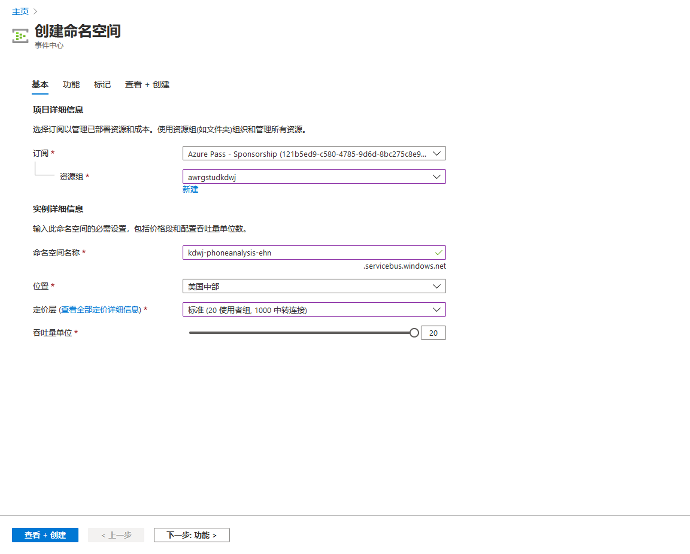
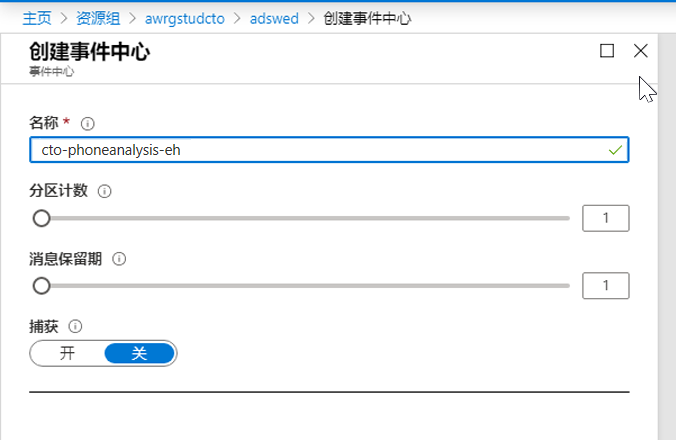
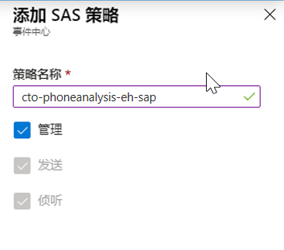
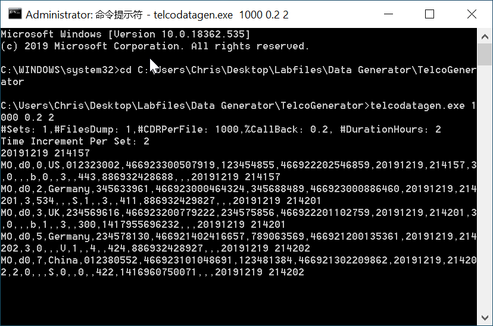
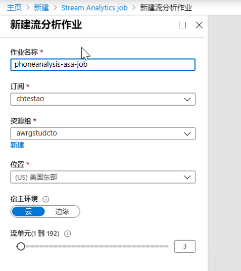
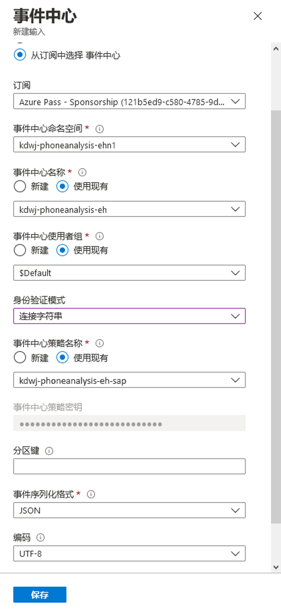
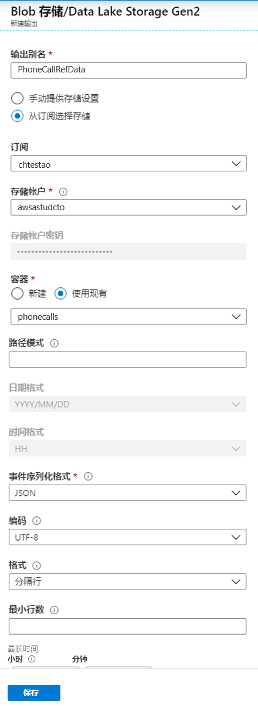
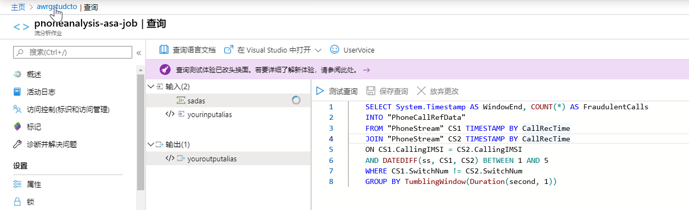
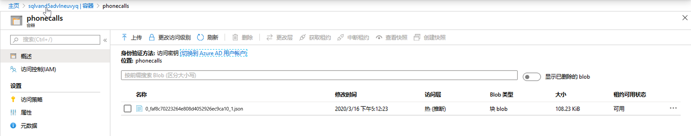

---
lab:
    title: '使用流分析执行实时分析'
    module: '模块 6:使用流分析执行实时分析'
---

# DP 200 - 实施数据平台解决方案
# 实验室 6 - 使用流分析执行实时分析

**预计用时**：60 分钟

**先决条件**：假设已阅读了本实验室的案例研究。假设模块 1 的内容和实验室：也已完成 Azure 数据工程相关内容

**实验室文件**：本实验文件位于 _Allfiles\Labfiles\Starter\DP-200.6_ 文件夹。

## 实验室概述

学生能够描述什么是数据流以及事件处理如何运行，并为 AdventureWorks 案例研究选择合适的数据流引入技术。他们会预配所选的引入技术，并将其与流分析集成，以创建一个可处理流数据的解决方案。

## 实验室目标
  
完成本实验室课程后，你将能够：

1. 解释数据流和事件处理
1. 通过事件中心引入数据
1. 启动数据生成应用程序
1. 使用流分析作业处理数据

## 情景
  
作为数字转型项目的一部分，CIO 已责成你帮助客户服务部门识别欺诈电话。在过去的几年中，客户服务部门发现欺诈客户的电话增加，这些客户要求对不在保修期内的自行车，甚至不在 AdventureWorks 购买的自行车提供支持。 

该部门目前依靠客户服务代理的经验进行识别。因此，他们希望实现一个系统，以帮助代理实时跟踪谁可能提出欺诈性主张。

在本实验室课程结束时，你将学习：

1. 解释数据流和事件处理
1. 通过事件中心引入数据
1. 启动数据生成应用程序
1. 使用流分析作业处理数据

> **重要事项**：在完成本实验时，请记下你在设置或配置任务中遇到的任何问题，并将其记录在位于 _\Labfiles\DP-200-Issues-Doc.docx_ 的文档的表格中。记录实验编号，记录技术，说明问题以及解决方案。保存该文档，以便在稍后的模块中参考它。

## 练习 1：解释数据流和事件处理

预计用时：15 分钟

小组练习
  
本练习的主要任务如下：

1. 从案例研究和场景中，确定 AdventureWorks 的数据流引入技术，以及你作为数据工程师要完成社交媒体分析要求所应执行的高级任务。

1. 讲师将与小组讨论结果。

### 任务1：确定 AdventureWorks 的数据要求和结构。

1. 从实验室虚拟机中，启动 **Microsoft Word**，然后从 **Allfiles\Labfiles\Starter\DP-200.6** 文件夹中打开文件 **DP-200-Lab06-Ex01.docx**。

1. 作为小组，花 **10 分钟** 讨论并列出你的小组在案例研究文档中确定的数据要求和数据结构。

### 任务 2：与讲师讨论结果

1. 讲师将阻止小组讨论调查结果。

> **结果**：完成本练习后，你已创建一个 Microsoft Word 文档，其中显示了数据流引入表，以及你作为数据工程师要完成社交媒体分析要求所应执行的高级任务。

## 练习 2：通过事件中心引入数据。
  
预计用时：15 分钟

个人练习
  
本练习的主要任务如下：

1. 创建和配置事件中心命名空间。

1. 创建和配置事件中心。

1. 配置事件中心安全性。

### 任务 1：创建和配置事件中心命名空间。

1. 在 Azure 门户中，单击屏幕左上角的 **“主页”** 超链接。

1. 在 Azure 门户中，选择 **“创建资源”** 图标，输入 **“事件中心”**，然后从搜素结果中选择 **“事件中心”**。在“事件中心”屏幕上，单击 **“创建”**。

1. 在“创建命名空间”边栏选项卡中，键入以下选项：
    - **名称**： **xx-phoneanalysis-ehn**，其中 xx 是你的首字母缩写
    - **定价层**： **标准**
    - **订阅**： **你的订阅**
    - **资源组**： **awrgstudxx**
    - **位置**：选择离你最近的位置
    - **吞吐量单位**： **20**
    - 将其他选项保留为默认设置

        

1. 然后单击 **“创建”**。

    > **注意**：创建事件中心命名空间大约需要 1 分钟。
   
### 任务 2：创建和配置事件中心

1. 在 Azure 门户中，单击屏幕左上角的 **“主页”** 超链接。

1. 在 Azure 门户的边栏选项卡中，单击 **“资源组”**，然后单击 **“awrgstudxx”**，其中 **xx** 是你的姓名缩写

1. 单击 **xx-phoneanalysis-ehn**，其中 **xx** 是你的姓名缩写。

1. 在 **“xx-phoneanalysis-ehn”** 屏幕中，单击 **“事件中心”**。

1. 提供名称 **xx-phoneanalysis-eh**，将其他设置保留为默认值，然后选择 **“创建”**。

    

    > **注意**：大约 10 秒后，你会收到一条消息，提示已创建事件中心

### 任务 3：配置事件中心安全性

1. 在 Azure 门户的 **xx-phoneanalysis-ehn** 屏幕中， **xx** 是你的姓名缩写。滚动到窗口底部，然后单击 **“xx-phoneanalysis-eh”** 事件中心。

1. 要授予对事件中心的访问权限，请在左侧的边栏选项卡中单击 **“共享访问策略”**。

1. 在 **“xx-phoneanalysis-eh - 共享访问策略”** 屏幕下，通过选择 **“+添加”** 来创建具有 **“管理”** 权限的策略。将策略命名为 **xx-phoneanalysis-eh-sap**，选中 **“管理”**，然后选择 **“创建”**。

    

1. 单击新创建的策略 **xx-phoneanalysis-eh-sap**，然后选择 **CONNECTION STRING - PRIMARY KEY** 的复制按钮，并将 CONNECTION STRING - PRIMARY KEY 粘贴到记事本中，在稍后的练习中会用到它。

    >**注意**：连接字符串如下所示：
    > ```CMD
    >Endpoint=sb://<Your event hub namespace>.servicebus.windows.net/;SharedAccessKeyName=<Your shared access policy name>;SharedAccessKey=<generated key>;EntityPath=<Your event hub name>
    >```
    > 请注意，连接字符串包含多个用分号分隔的键值对：终结点、SharedAccessKeyName、SharedAccessKey 和 EntityPath。

1. 在门户中关闭事件中心屏幕

> **结果**：完成本练习后，你已在事件中心命名空间中创建了 Azure 事件中心，并为事件中心设置了可用于提供服务访问的安全性。

## 练习 3：启动电信事件生成器应用程序

预计用时：15 分钟

个人练习

本练习的主要任务如下：

1. 更新应用程序连接字符串

1. 运行该应用程序

### 任务 1：更新应用程序连接字符串。

1. 浏览到位置 **Labfiles\Starter\DP-200.6\DataGenerator**

1. 在所选的文本编辑器中打开 **telcodatagen.exe.config** 文件

1. 使用以下详细信息更新配置文件中的 <appSettings> 元素：

    - 将 **EventHubName** 键的值设置为连接字符串中 **EntityPath** 的值。
    - 将 **“Microsoft.ServiceBus.ConnectionString”** 键的值设置为 **不带 EntityPath 值** 的连接字符串（不要忘记删除它前面的分号）。

1. 保存文件。

### 任务 2：运行应用程序：

1. 单击 **“开始”**，然后输入 **“CMD”**

1. 右键点击 **“命令提示符”**，点击 **“以管理员身份运行”**，然后在“用户访问控制”屏幕中，单击 **“是”**

1. 在命令提示符中，浏览到该位置 **Labfiles\Starter\DP-200.6\DataGenerator**

1. 键入以下命令： 

    ```CMD
    telcodatagen.exe 1000 0.2 2
    ...

    > 注意：此命令采用以下参数：
每小时调用数据记录数。
欺诈概率百分比，即应用模拟欺诈调用的频率。值 0.2 表示大约 20% 的通话记录看起来是欺诈性的。
持续时间（以小时为单位），即应用程序应运行的小时数。你还可以随时通过在命令行结束进程 (Ctrl+C) 来停止应用。

    

几秒钟后，应用程序开始在屏幕上显示电话记录，同时将它们发送到事件中心。电话呼叫数据包含以下字段：

|记录 | 定义 |
|-|-|
|CallrecTime |调用开始时间的时间戳。|
|SwitchNum |用来接通电话的电话开关。对于此示例，开关是代表原产国家/地区（美国、中国、英国、德国或澳大利亚）的字符串。|
|CallingNum |呼叫者的电话号码。|
|CallingIMSI |国际移动用户识别码 (IMSI)。这是调用方的唯一标识符。|
|CalledNum | 呼叫接收人的电话号码。|
|CalledIMSI| 国际移动订阅者标识 (IMSI)。它是呼叫接收人的唯一标识符。|

1. 最小化命令提示窗口。 

> **结果**：完成此练习后，你已经配置了一个应用程序来生成数据，以使呼叫中心接收的电话呼叫数最小。

## 练习 4：使用流分析作业处理数据

预计用时：15 分钟

个人练习

本练习的主要任务如下：

1. 预配流分析作业。

1. 指定流分析作业输入。

1. 指定流分析作业输出。

1. 定义流分析查询。

1. 启动流分析作业。

1. 验证是否已收集流数据

### 任务 1：配置流分析作业。

1. 返回到 Azure 门户，导航并单击 **“创建资源”** 图标，键入 **STREAM**，然后依次单击 **“流分析作业”**、 **“创建”**。

1. 在 **“新建流分析作业”** 屏幕中，填写以下详细信息，然后单击 **“创建”**：
    - **作业名称**：phoneanalysis-asa-job。
    - **订阅**：选择你的订阅
    - **资源组**：awrgstudxx
    - **位置**：选择离你最近的位置。
    - 将其他选项保留为默认设置

        

    > **注意**：你将收到一条消息，指出在大约 10 秒后创建流分析作业。在 Azure 门户中更新可能需要几分钟的时间。

### 任务 2：指定流分析作业输入。

1. 在 Azure 门户的边栏选项卡中，单击 **“资源组”**，然后单击 **“awrgstudxx”**，其中 **xx** 是你的姓名缩写。

1. 单击 **phoneanalysis-asa-job**。

1. 在你的 **phoneanalysis-asa-job** 流分析作业窗口的左侧边栏选项卡中，在 **“作业拓扑”** 下，单击 **“输入”**。

1. 在 **“输入”** 屏幕中，单击 **“添加流输入”**，然后单击 **“事件中心”**。

1. 在“事件中心”屏幕中，键入以下值并单击 **“保存”** 按钮。
    - **输入别名**：输入 **PhoneStream** 作为此作业输入的名称。
    - **从你的订阅中选择事件中心**：已检查
    - **订阅**：你的订阅名称
    - **事件中心命名空间**：xx-phoneanalysis-ehn
    - **事件中心名称**：使用现有的命名 xx-phoneanalysis-eh
    - **事件中心策略名称**：xx-phoneanalysis-eh-sap
    - 将其余条目保留为默认值。最后，单击 **“保存”***。

        

1. 完成后，**PhoneStream** 输入作业将出现在输入窗口下。关闭输入窗口以返回到“资源组”页面

### 任务 3：指定流分析作业输出。

1. 单击 **phoneanalysis-asa-job**。

1. 在你的 **phoneanalysis asa job** 流分析作业窗口的左侧边栏选项卡中，在 **“作业拓扑”** 下，单击 **“输出”**。

1. 在 **“输出”** 屏幕中，单击 **“添加”**，然后单击 **“Blob 存储”**。

1. 在 **“Blob 存储”** 窗口中，在窗格中键入或选择以下值：
    - **输出别名**： **PhoneCallRefData**
    - **从你的订阅中选择事件中心**：已检查
    - **订阅**：你的订阅名称
    - **存储帐户**： **awsastudxx**:，其中 xx 是你的姓名缩写
    - **容器**： **使用现有** 并选择 **phonecalls**
    - 将其余条目保留为默认值。最后，单击 **“保存”**。

        

1. 关闭输出屏幕以返回到“资源组”页面

### 任务 4：定义流分析查询。

1. 单击 **phoneanalysis-asa-job**。

1. 在你的 **“phoneanalysis-asa-job”** 窗口，在窗口中间的 **“查询”** 屏幕中，单击 **“编辑查询”**

1. 在代码编辑器中替换以下查询：

    ```SQL
    SELECT
        *
    INTO
        [YourOutputAlias]
    FROM
        [YourInputAlias]
    ```

1. 替换为

    ```SQL
    SELECT System.Timestamp AS WindowEnd, COUNT(*) AS FraudulentCalls
    INTO "PhoneCallRefData"
    FROM "PhoneStream" CS1 TIMESTAMP BY CallRecTime
    JOIN "PhoneStream" CS2 TIMESTAMP BY CallRecTime
    ON CS1.CallingIMSI = CS2.CallingIMSI
    AND DATEDIFF(ss, CS1, CS2) BETWEEN 1 AND 5
    WHERE CS1.SwitchNum != CS2.SwitchNum
    GROUP BY TumblingWindow(Duration(second, 1))
    ...

    > 注意：该查询对 5 秒调用间隔数据执行自联接。要检查欺诈电话，你可以根据 CallRecTime 值自联接流数据。然后，你可以查找 CallingIMSI 值（起始号码）相同但 SwitchNum 值（起始国家/地区）不同的呼叫记录。当对流数据使用 JOIN 操作时，join 必须对匹配行在时间上可以间隔多远提供一些限制。由于流数据是无限的，因此关系的时间范围是使用 DATEDIFF 函数在 join 的 ON 子句中指定的。
    除了 DATEDIFF 函数外，此查询就像普通的 SQL join 一样。此查询中使用的 DATEDIFF 函数特定于流分析，并且必须出现在 ON...BETWEEN 子句中。

    

1. 选择 **“保存查询”**。

1. 关闭“查询”窗口以退回“流分析”作业页面。


### 任务 5：启动流分析作业

1. 在 **“phoneanalysis-asa-job”** 窗口，在屏幕中间的 **“查询”** 窗口，单击 **“启动”**
 
1. 在打开的 **“启动作业”** 对话框，点击 **“现在”**，然后点击 **“启动”**。 

>**注**：在你的 **phoneanalysis-asa-job** 窗口，作业开始一分钟后会显示一条消息，并且启动的字段将更改为启动的时间

>**注意**：运行 2 分钟，以便捕获数据。

### 任务 6：确认收集到流数据

1. 在 Azure 门户的边栏选项卡中，单击 **“资源组”**，然后单击 **“awrgstudxx”**，再单击 **“awsastudxx”**，其中 **“xx”** 是你的姓名首字母缩写。

1. 在 Azure 门户中，点击 **“容器”** 框，然后点击名为 **“电话”** 的容器。

1. 确认出现 JSON 文件，并记下大小列。

    

1. 刷新 Microsoft Edge，并在屏幕刷新后记录文件大小

    >**注意**：你可以下载文件以查询 JSON 数据，也可以将数据输出到 Power BI。

> **结果**：完成此练习后，你已将 Azure 流分析配置为将流数据收集到 Azure Blob 中的 JSON 文件存储中。你已经通过流式电话呼叫数据完成了这项工作。

## 关闭

1. 在 Azure 门户的边栏选项卡中，单击 **“资源组”**，然后单击 **“awrgstudxx”**，再单击 **“phoneanalysis-asa-job”**。

1. 在 **phoneanalysis-asa-job** 屏幕中，单击 **“停止”**。在 **“停止流式处理作业”** 对话框中，单击 **“是”**。

1. 关闭命令提示符应用程序。