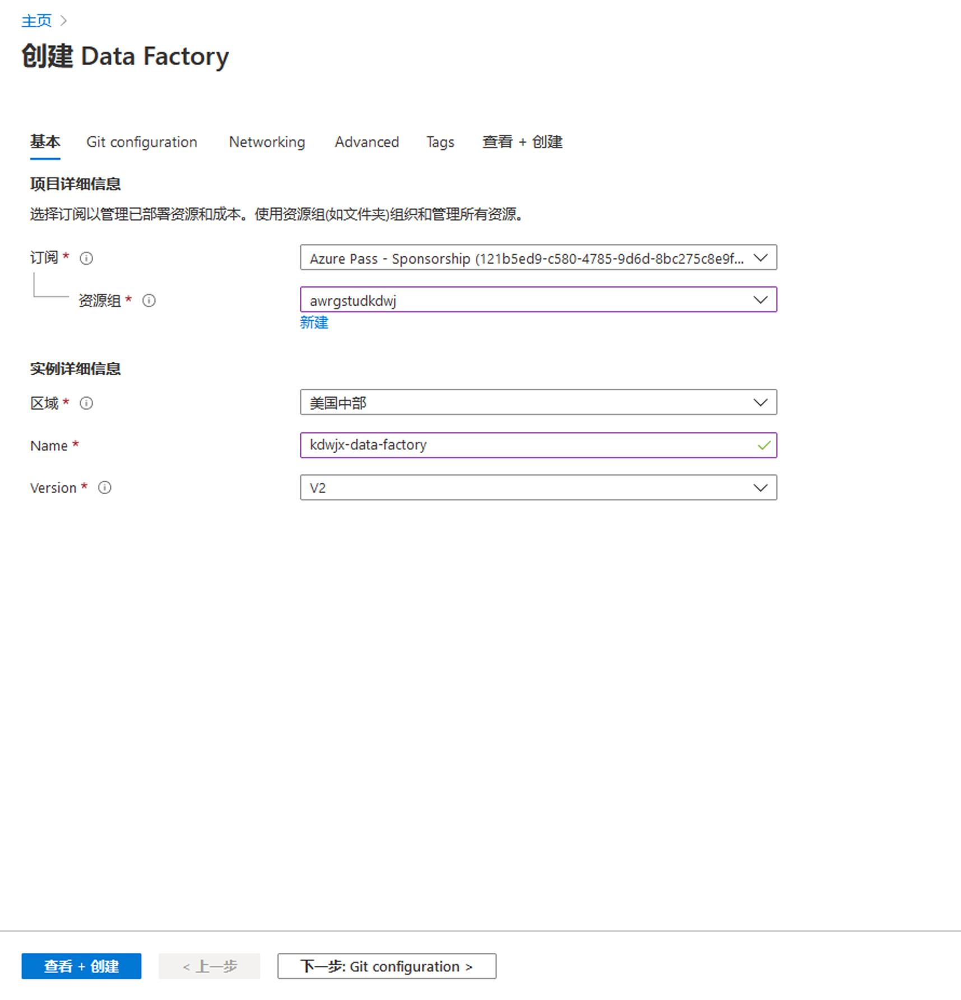
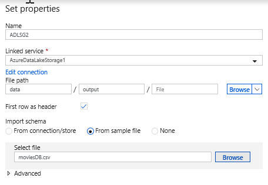
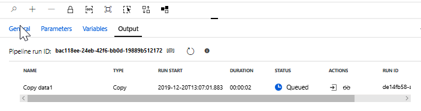
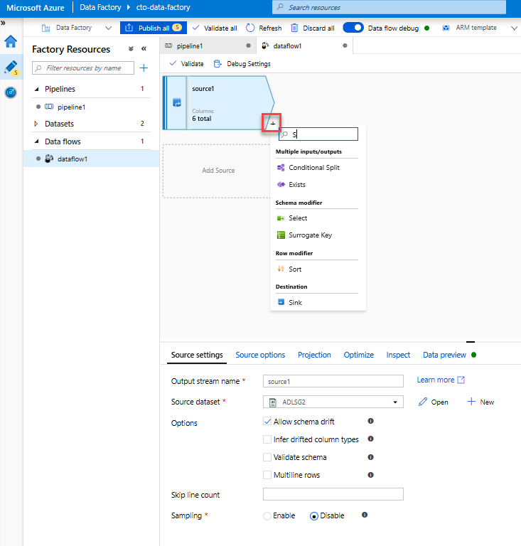
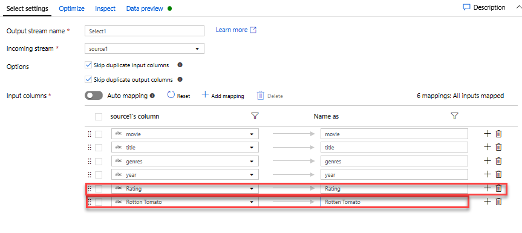
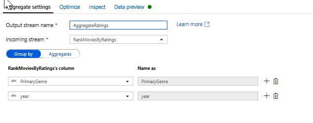

# DP 200 - 实现数据平台解决方案
# 实验室 7 - 使用 Azure 数据工厂协调数据移动

**预计用时**：70 分钟

**先决条件**：假设已阅读了本实验室的案例研究。假设模块 1：适用于数据工程师的 Azure 的内容和实验室也已完成

* **Azure 订阅**：如果你没有 Azure 订阅，在开始之前请创建
    一个[免费帐户](https://azure.microsoft.com/free/) 。

* **Azure Data Lake Storage Gen2 存储帐户**：如果你没有 ADLS
    Gen2 存储帐户，请参阅[创建 ADLS Gen2 存储
    帐户](https://docs.microsoft.com/zh-cn/azure/storage/blobs/data-lake-storage-quickstart-create-account)中的说明。

* **Azure Synapse Analytics**：如果你没有 Azure Synapse Analytics 帐户，请参阅[创建 SQL DW
    帐户](https://docs.microsoft.com/zh-cn/azure/sql-data-warehouse/create-data-warehouse-portal)中的说明。

**实验室文件**：本实验室文件位于 _Allfiles\Labfiles\Starter\DP-200.7_ 文件夹。

## 实验室概述

在本模块中，学生将学习如何使用 Azure 数据工厂来协调来自各种数据平台技术的数据移动。他们将能够解释此技术的功能，并能够设置端到端数据管道，以从 SQL 数据库中引入数据并将数据加载到 Azure Synapse Analytics 中。学生还将演示如何调用计算资源。

## 实验室目标
  
完成本实验室后，你将能够：

1. 设置 Azure 数据工厂
2. 使用复制活动引入数据
3. 使用映射数据流任务执行转换
4. 使用计算资源执行转换

## 应用场景
  
你正在评估可帮助提取、加载、转换数据并将其传输到数据仓库的工具，并已要求你的团队中的数据工程师展示 Azure 数据工厂的概念证明，以探索产品的转换功能。概念证明不必与 AdventureWorks 数据相关，并且你已允许他们自由选择一个数据集来展示其功能。

另外，数据科学家要求确认是否可以从 Azure 数据工厂调用 Azure Databricks。为此，你将创建简单的概念验证数据工厂管道，该管道调用 Azure Databricks 作为计算资源。

在本实验室课程结束时，你将能够：

1. 设置 Azure 数据工厂
2. 使用复制活动引入的数据
3. 使用映射数据流任务执行转换
4. 使用计算资源执行转换

> **重要事项**：在完成本实验室课程时，请记下你在任何预配或配置任务中遇到的任何问题，并将其记录在位于 _\Labfiles\DP-200-Issues-Doc.docx_ 的文档的表中。记录实验室编号，记录技术，说明问题以及解决方案的内容。保存该文档，以便在稍后的模块中参考它。

## 练习 1：设置 Azure 数据工厂

预计用时：15 分钟

个人练习

本练习的主要任务如下：

1. 设置 Azure 数据工厂

### 任务 1：设置 Azure 数据工厂。

创建数据工厂：使用 [Azure 门户](https://portal.azure.com)创建数据工厂。 

1. 在 Microsoft Edge 中，转到“Azure 门户”选项卡，单击 **“+ 创建资源”**，键入 **“工厂”**，然后从搜索结果中选择 **“数据工厂”**，然后单击 **“创建”**。

2. 在“新建数据工厂”屏幕，使用以下选项创建新的数据工厂：
    - **订阅**：你的订阅
    - **资源组**：awrgstudxx
    - **区域**：选择离你最近的位置    
    - **名称**：xx-data-factory，其中 xx 是你的姓名首字母缩写
    - **版本**：V2
    - 将其他选项保留为默认设置

        

    > **备注**：创建数据工厂大约需要 1 分钟。

3. 在 **“git 配置”** 边栏选项卡中， **选中** “稍后配置 git”。 

4. 单击 **“查看 + 创建”**，然后选择 **“创建”**。

> **结果**：完成本练习后，你已经创建了一个 Azure 数据工厂实例

## 练习 2：使用复制活动引入数据
  
预计用时：15 分钟

个人练习
  
本练习的主要任务如下：

1. 将复制活动添加到设计器

2. 创建新的 HTTP 数据集以用作源

3. 创建新的 ADLS Gen2 接收器

4. 测试复制活动

### 任务 1：将复制活动添加到设计器

1. 在部署成功消息上，单击按钮 **“转到资源”**。

2. 在 xx-data-factory 屏幕的中间位置，单击 **“创作和监视”** 按钮

3. **打开创作画布** 如果来自 ADF 主页，单击左边栏的 **铅笔图标** 并选择 **“+ 管道按钮”**，以打开创作画布并创建管道。

4. **添加复制活动** 在“活动”窗格中，打开“移动和转换”折叠选项卡，然后将“复制数据”活动拖动到管道画布上。

    


### 任务 2：创建新的 HTTP 数据集以用作源

1. 在“复制活动”设置的“源”选项卡中，单击 **“+ 新建”**

2. 在数据存储列表中，选择 **“HTTP”** 磁贴，然后单击“继续”

3. 在文件格式列表中，选择 **“DelimitedText”** 格式磁贴，然后单击“继续”

4. 在“设置属性”边栏选项卡中，为数据集提供一个易于理解的名称，例如 **“HTTPSource”**，然后单击 **“链接服务”** 下拉列表。如果尚未创建 HTTP 链接服务，请选择 **“新建”**。

5. 在“新建链接服务(HTTP)”屏幕中，指定 movieDB csv 文件的 URL。你可以使用以下终结点在不需要身份验证的情况下访问数据：

    https://raw.githubusercontent.com/djpmsft/adf-ready-demo/master/moviesDB.csv

6. 将其放在 **“基 URL”** 文本框中。 

7. 在 **“身份验证类型”** 下拉列表中，选择 **“匿名”**，然后单击 **“创建”**。


    -  创建并选择链接服务后，请指定其余的数据集设置。这些设置指定我们要在你的连接中拉取数据的方式和位置。由于 URL 已经指向文件，因此不需要相对的终结点。由于数据在第一行有一个标题，请将 **“第一行作为标题”** 设置为真，并选择 **“从连接/存储中导入架构”**，以便从文件本身拉取架构。选择 **“Get”** 作为请求方法。你将看到如下屏幕。

        
           
    - 完成后单击 **“确定”**。
   
    a. 为了验证数据集配置是否正确，请单击复制活动的“源”选项卡中的 **“预览数据”**，以获取数据的小型快照。
   
   

### 任务 3：创建一个新的 ADLS Gen2 数据集接收器

1. 单击 **“接收器选项卡”**，然后单击 **“+ 新建”**

2. 选择 **“Azure Data Lake Storage Gen2”** 磁贴，然后单击 **“继续”**。

3. 选择 **DelimitedText** 格式磁贴，然后单击 **“继续”**。

4. 在“设置属性”边栏选项卡中，为数据集提供一个易于理解的名称，例如 **“ADLSG2”**，然后单击 **“链接服务”** 下拉列表。如果尚未创建 ADLS 链接服务，请选择 **“新建”**。

5. 在“新建链接服务 (Azure Data Lake Storage Gen2)”边栏选项卡中，选择你的身份验证方法为 **“帐户密钥”**，选择你的 **“Azure 订阅”** 并选择你的存储帐户名称 **“awdlsstudxx”**。你将看到如下屏幕：

   

6. 单击 **“创建”**

7. 配置链接服务后，进入“设置属性”边栏选项卡。在写入此数据集时，最好指定要将 moviesDB.csv 复制到的文件夹。在下面的示例中，我会写入文件系统 **“data”** 中的文件夹 **“output”**。尽管可以动态创建文件夹，但在写入之前必须存在该文件系统。将 **“第一行作为标题”** 设为 true。你可以从 **样本文件** 导入架构（使用 **Labfiles\Starter\DP-200.7\SampleFiles** 中的 moviesDB.csv 文件）  

   

8. 完成后单击 **“确定”**。

### 任务 4：测试复制活动

至此，你已经完全配置了复制活动。若要对其进行测试，请单击位于管道画布顶部的 **“调试”** 按钮。这将启动管道调试运行。

1. 要监视管道调试运行的进度，请单击管道的 **“输出”** 选项卡

2. 要查看活动输出的更详细描述，请单击眼镜图标。这将打开复制监视屏幕，该屏幕提供了有用的指标，例如数据读取/写入、吞吐量和深度持续时间统计信息。

   

3. 要验证复制是否按预期工作，请打开你的 ADLS Gen2 存储帐户并检查你的文件是否按预期写入


## 练习 3：使用映射数据流转换数据
  
预计用时：30 分钟

个人练习

现在，你已将数据移动到 Azure Data Lake Store Gen2 中，并已准备好生成映射数据流，该数据流将通过 Spark 群集大规模转换你的数据，然后将其加载到数据仓库中。 
  
本练习的主要任务如下：

1. 准备环境

2. 添加数据源

3. 使用映射数据流转换

4. 写入数据接收器

5. 运行管道

### 任务 1：准备环境

1. **打开“数据流调试”** 打开位于创作模块顶部的 **“数据流调试”** 滑块。 

    > 备注：数据流群集需要 5-7 分钟的预热时间。

2. **添加数据流活动** 在“活动”窗格中，打开“移动和转换”折叠选项卡，然后将 **“数据流”** 活动拖动到管道画布上。 

    

3. 在“设置”选项卡中，为变量 **“数据流”** 单击 **“+ 新建”**

### 任务 2：添加数据源

1. **添加 ADLS 源** 双击画布中的“映射数据流”对象。单击“数据流”画布中的“添加源”按钮。在 **“源数据集”** 下拉列表中，选择在复制活动中使用的 **“ADLSG2”** 数据集

    


    * 如果你的数据集指向包含其他文件的文件夹，则可能需要创建另一个数据集或利用参数化来确保仅读取 moviesDB.csv 文件
    * 如果你尚未在 ADLS 中导入架构，但已经引入数据，则请转至数据集的“架构”选项卡，然后单击“导入架构”，以便数据流获知架构投影。

    调试群集预热后，请通过“数据预览”选项卡验证是否正确加载了数据。单击“刷新”按钮后，“映射数据流”将显示计算一个快照，该快照反映数据在每次转换时是什么样的。
  
### 任务 3：使用映射数据流转换

1. **添加“选择转换”以重命名和删除列** 在数据预览中，你可能已经注意到“Rotton Tomatoes”列拼写错误。若要正确命名并删除未使用的“Rating”列，你可以添加“选择转换”[](https://docs.microsoft.com/azure/data-factory/data-flow-select)，方法是单击 ADLS 源节点旁边的“+”图标，然后在“架构修饰符”下选择“选择”。
    
    

    在 **“名称”** 字段，将“Rotton”更改为“Rotten”。要删除“Rating”列，请将鼠标悬停在该列上，然后单击垃圾桶图标。

    

2. **添加筛选器转换以筛选掉不需要的年份** 假设你只对 1951 年以后制作的电影感兴趣。你可以添加一个“筛选器转换”[](https://docs.microsoft.com/azure/data-factory/data-flow-filter)来指定筛选条件，方法是单击“选择转换”旁边的 **“+”** 图标，然后在“行修饰符”下选择 **“筛选器”** 。单击 **“表达式框”** 以打开[“表达式生成器”](https://docs.microsoft.com/azure/data-factory/concepts-data-flow-expression-builder)，并输入你的筛选条件。使用[映射数据流表达式语言](https://docs.microsoft.com/azure/data-factory/data-flow-expression-functions)的语法，**toInteger(year) > 1950** 将字符串年份值转换为整数，并在该值高于 1950 时筛选行。

    

    你可以使用表达式生成器的嵌入式数据预览窗格来验证条件是否正常工作

    


4. **添加派生转换以计算主要类型** 你可能已注意到，genres 列是由“|”字符分隔的。如果你只关注每列中的第 *一个* 类型，则可以通过[派生列](https://docs.microsoft.com/azure/data-factory/data-flow-derived-column)转换来派生名为 **“PrimaryGenre”** 的新列，方法是单击筛选器转换旁的 **“+”** 图标，并在架构修饰符下选择“派生”。与筛选器转换类似，派生列使用“映射数据流”表达式生成器来指定新列的值。

    

    在本场景中，你要尝试从 genres 列提取第一个流派，格式为“genre1|genre2|...|genreN”。使用 **locate** 函数获取 genres 字符串中“|”的第一个索引（从 1 开始）。使用 **iif** 函数，如果该索引大于 1，则可以通过 **left** 函数计算 primary genre，该 left 函数将返回字符串中索引左侧的所有字符。否则，PrimaryGenre 值等于 genres 字段。你可以通过表达式生成器的“数据预览”窗格验证输出。

   
4. **通过窗口转换对电影进行排名** 假设你对某电影在其上映当年在其所属特定电影类型中的排名情况感兴趣。你可以添加一个[窗口转换](https://docs.microsoft.com/azure/data-factory/data-flow-window)来定义基于窗口的聚合，方法是单击派生列转换旁边的 **“+”** 图标，然后单击架构修饰符下的窗口。要完成此操作，请指定窗口化依据、排序依据、范围以及如何计算新的窗口列。在本例中，我们将“PrimaryGenre”和无限范围的“year”作为窗口化依据，按烂番茄评分降序排序，计算出一个名为“RatingsRank”的新列，该列表示每部电影在其特定类型和年份内的排名。

    

    

    

    

5. **使用聚合转换聚合评分** 现在你已收集并派生了所有必需数据，我们可以添加一个[聚合转换](https://docs.microsoft.com/azure/data-factory/data-flow-aggregate)，根据所需的组计算指标，方法是单击窗口转换旁边的 **“+”** 图标并单击架构修饰符下的“聚合”。像在窗口转换中一样，按 PrimaryGenre 和 year 对电影进行分组

    

    在“聚合”选项卡中，你可以按列对指定的组进行聚合计算。对于每个 genre 和 year，我们要获得平均烂番茄评分、评分最高和最低的电影（利用开窗函数）以及每组中电影的数量。聚合可显著减少转换流中的行数，并且只传播转换中指定的分组依据列和聚合列。

    

    * 要查看聚合转换如何更改数据，请使用“数据预览”选项卡
   

6. **通过“更改行转换”指定更新插入条件** 如果要写入表格接收器，可以通过单击聚合转换旁边的“+”图标并单击行修饰符下的“更改行”来使用[更改行转换](https://docs.microsoft.com/azure/data-factory/data-flow-alter-row)指定行上的插入、删除、更新和更新插入策略。由于你一直在插入和更新，因此可以指定始终更新插入所有行。

    

    

### 任务 4：写入数据接收器

1. **写入 Azure Synapse Analytics 接收器** 现在你已完成所有转换逻辑，已准备好写入接收器。
    1. 通过单击更新插入转换旁边的 **“+”** 图标并单击目标下的 **“接收器”**，添加“接收器” 。
    1. 在“接收器”选项卡中，通过 **“+ 新建”** 按钮创建新数据仓库数据集。
    1. 从磁贴列表中选择 **“Azure Synapse Analytics”**。
    1. 选择一个新的链接服务，并将你的 Azure Synapse Analytics 连接配置为连接到模块 5 中创建的 DWDB 数据库。完成后请单击 **“创建”**。
    
    1. 在数据集配置中，选择 **“创建新表”**，并在架构中输入 **“Dbo”**，在表名中输入 **“Ratings”**。完成后单击 **“确定”**。
    
    1. 由于指定了更新插入条件，因此你需要转到“设置”选项卡，然后根据 PrimaryGenre 和 year 两个键列选择“允许更新插入”。
    
至此，你已完成构建转换映射数据流。现在该运行管道并查看结果了！


## 任务 5：运行管道

1. 转至画布中的 pipeline1 选项卡。由于数据流中的 Azure Synapse Analytics 使用 [PolyBase](https://docs.microsoft.com/sql/relational-databases/polybase/polybase-guide?view=sql-server-2017)，你必须指定一个 Blob 或 ADLS 暂存文件夹。在“执行数据流”活动的“设置”选项卡中，打开 PolyBase 折叠选项卡，然后选择你的 ADLS 链接服务并指定暂存文件夹路径。

    

2. 在发布管道之前，请运行另一个调试运行，以确认它按预期工作。查看“输出”选项卡，你可以监视两项活动的运行状态。

3. 一旦两个活动都成功，你可以单击数据流活动旁边的眼镜图标，以便更深入地了解数据流运行。

4. 如果使用本实验室中描述的相同逻辑，则数据流应向 SQL DW 写入 737 行。你可以转到 [SQL Server Management Studio](https://docs.microsoft.com/sql/ssms/download-sql-server-management-studio-ssms?view=sql-server-2017) 验证管道是否正常工作并查看写入的内容。

    

## 练习 4：Azure 数据工厂和 Databricks
  
预计用时：15 分钟

个人练习
  
本练习的主要任务如下：

1. 生成 Databricks 访问令牌。

2. 生成 Databricks 笔记本

3. 创建链接服务

4. 创建使用 Databricks 笔记本活动的管道。

5. 触发管道运行。

### 任务 1：生成 Databricks 访问令牌。

1. 在 Azure 门户中，单击 **“资源组”**，然后单击 **“awrgstudxx”**，再单击 **“awdbwsstudxx”**，其中 xx 是你的姓名首字母缩写。

2. 单击 **“启动工作区”**

3. 单击 Databricks 工作区右上角的用户 **配置文件图标**。

4. 单击 **“用户设置”**。

5. 转到“访问令牌”选项卡，然后单击 **“生成新令牌”** 按钮。

6. 在 **注释** 中输入描述“用于 ADF 集成”，然后将 **生存期** 设置为 10 天并单击 **“生成”**

7. 复制生成的令牌并存储在记事本中，然后单击 **“完成”**。

### 任务 2：生成 Databricks 笔记本

1. 在屏幕左侧，单击 **“工作区”** 图标，然后单击词语“工作区”旁的箭头，再单击 **“创建”**，然后单击 **“文件夹”**。将文件夹命名为 **“adftutorial”**，然后单击 **“创建文件夹”**。adftutorial 文件夹会显示在工作区中。

2. 单击 adftutorial 旁的下拉箭头，然后单击 **“创建”**，再单击 **“笔记本”**。

3. 在“创建笔记本”对话框中，键入名称 **“mynotebook”**，并确保语言显示为 **“Python”**，然后单击 **“创建”**。出现带有 mynotebook 标题的笔记本/

4. 在新创建的笔记本“mynotebook”中添加以下代码：

    ```Python
    # 创建小组件，用于利用参数和打印参数

    dbutils.widgets.text("input", "","")
    dbutils.widgets.get("input")
    y = getArgument("input")
    print ("Param -\'input':")
    print (y)
    ```

    > **备注**：笔记本路径是 **/adftutorial/mynotebook**

### 任务 3：创建链接服务

1. 在 Microsoft Edge 中，单击 Azure 门户中门户的选项卡，然后返回到 Azure 数据工厂。

2. 在 **“xx数据工厂”** 屏幕中，单击 **“创作和监视”**。这会打开另一个选项卡，以创建 Azure 数据工厂解决方案。

3. 在屏幕左侧，单击 **“创作”** 图标。这会打开数据工厂设计器。

4. 在屏幕底部，单击 **“连接”**，然后单击 **“+ 新建”**。

5. 在 **“新建链接服务”** 中，单击屏幕顶部的 **“计算”**，然后单击 **“Azure Databricks”**，再单击 **“继续”**。

6. 在 **“新建链接服务 (Azure Databricks)”** 屏幕中，填写以下详细信息并单击 **“完成”**
    - **名称**：xx_dbls，其中 xx 是你的姓名首字母缩写
    - **Databricks 工作区**：awdbwsstudxx，其中 xx 是你的姓名首字母缩写
    - **选择群集**：使用现有
    - **域/区域**：应该填充
    - **访问令牌**：从记事本中复制访问令牌并粘贴到此字段中
    - **从现有群集中选择**：awdbclstudxx，其中 xx 是你的姓名首字母缩写
    - 将其他选项保留为默认设置

    > **备注**：单击“完成”后，你将返回到 **“创作和监视”** 屏幕，其中已创建 xx_dbls，还有其他在之前练习中创建的链接服务。

### 任务 5：创建使用 Databricks 笔记本活动的管道。

1. 在屏幕左侧的“工厂资源”下，单击 **“+”** 图标，然后单击 **“管道”**。这将打开带有管道设计器的选项卡。

2. 在管道设计器的底部，单击参数选项卡，然后单击 **“+ 新建”**

3. 创建名为 **“name”**、类型为 **“字符串”** 的参数

4. 在 **“活动”** 菜单下，展开 **“Databricks”**。

5.  单击并将 **“笔记本”** 拖动到画布上。

6. 在底部 **Notebook1** 窗口的属性中，完成以下步骤：
    - 切换到 **“Azure Databricks”** 选项卡。
    - 选择你在上一过程中创建的 **xx_dbls**。

    - 切换到 **“设置”** 选项卡，并把 **/adftutorial/mynotebook** 放到笔记本路径中。
    - 展开 **“基本参数”**，然后单击 **“+ 新建”**
    - 创建名为 **“input”**、值为 **@pipeline().parameters.name** 的参数

7. 在 **Notebook1** 中，单击“另存为模板”按钮旁的 **“验证”**。屏幕右侧会显示窗口，表示“你的管道已验证。
未发现任何错误。”单击“>>”关闭此窗口。

8. 单击 **“全部发布”** 发布链接服务和管道。

    > **备注**：将显示一条消息，表示部署成功。

### 任务 6：触发管道运行

1. 在 **Notebook1** 中，单击 **“添加触发器”**，然后单击“调试”按钮旁的 **“立即触发”**。

2. **“管道运行”** 对话框要求输入 name 参数。这里使用 **/path/filename** 作为参数。单击“完成”。画布中的 Notebook1 活动上方会出现一个红色圆圈。

### 任务 7：监视管道

1. 在屏幕左侧，单击 **“监视”** 选项卡。确认你看到一个管道运行。创建一个执行笔记本的 Databricks 作业群集大约需要 5-8 分钟。

2. 定期选择 **“刷新”** 检查管道运行的状态。

3. 要查看与管道运行关联的活动运行，请选择 **“操作”** 列中的 **“查看活动运行”**。

### 任务 8：验证输出

1. 在 Microsoft Edge 中，单击选项卡 **“mynotebook - Databricks”** 

2. 在 **“Azure Databricks”** 工作区中，单击 **“群集”**，然后可以看到作业状态为待执行、正在运行或已终止。

3. 单击群集 **“awdbclstudxx”**，然后单击 **“事件日志”** 查看活动。

    > **备注**：你应该会看到事件类型 **“正在启动”** 以及触发管道运行的时间。