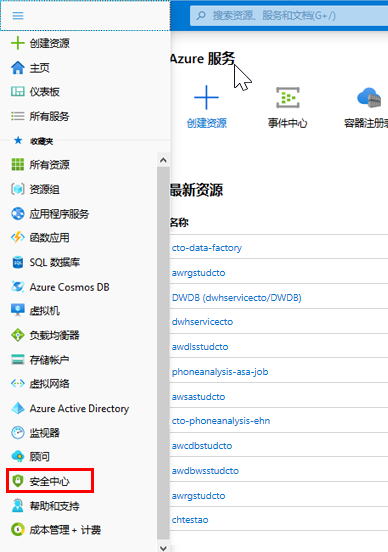
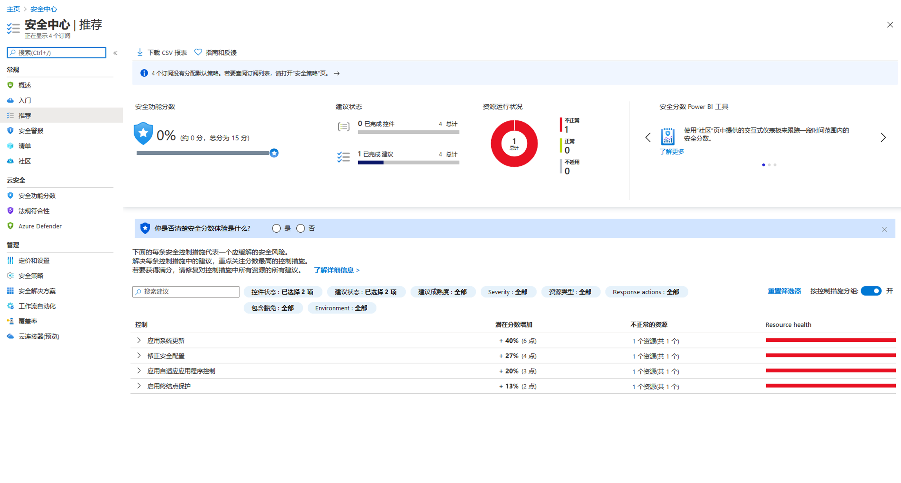

---
lab:
    title: '保护 Azure 数据平台'
    module: '模块 8:保护 Azure 数据平台'
---

# DP 200 - 实施数据平台解决方案
# 实验室 8 - 保护 Azure 数据平台

**预计用时**：75 分钟

**先决条件**：假设已阅读了本实验室的案例研究。假设从模块 1 到模块 7 的内容和实验室已完成。

**实验室文件**：本实验室的文件位于 _Allfiles\Labfiles\Starter\DP-200.8_ 文件夹中。

## 实验室概述

学生将能说明和记录可用于提供深度防御的不同安全方法。这将涉及到学生记录目前为止在课程中设置的安全性。它还能让学生识别 AdventureWorks 可能存在的任何安全漏洞。

## 实验室目标
  
完成本实验室课程后，你将能够：

1. 解释安全性
1. 描述关键安全组件
1. 保护存储帐户和 Data Lake Storage
1. 数据存储的安全保护
1. 流数据的安全保护

## 方案
  
作为 AdventureWorks 的高级数据工程师，你负责确保数据资产的安全。你正在对当前基础结构执行安全性检查，以确保安全性得以适当配置。该检查应针对目前为止创建的所有服务和数据进行全面检查，并确定安全配置中可能存在的任何差距。 

你还被要求加强 SQL 数据库 DeptDatabasesxx 的安全性，并被要求针对数据库设置审核，以便可以监视对数据库的访问。此外，你已了解事件中心的管理权限不够严格，且你希望删除此权限。

在本实验室结束时，你将学习到：

1. 解释安全性
1. 描述关键安全组件
1. 受保护的存储帐户和 Data Lake Storage
1. 受保护的数据存储
1. 受保护的流数据

> **重要事项**：在完成本实验室课程时，请记下你在任何设置或配置任务中遇到的任何问题，并将其记录在位于 _\Labfiles\DP-200-Issues-Doc.docx_ 的文档的表格中。记录实验室编号，记录技术，说明问题以及解决方案的内容。保存该文档，以便在稍后的模块中参考它。

## 练习 1：安全性简介

预计用时：15 分钟

小组练习
  
本练习的主要任务如下：

1. 采用分层的方法实现安全性。

1. 讲师将与小组讨论结果。

### 任务1：采用分层的方法实现安全性。

1. 从实验室虚拟机中，启动 **Microsoft Word**，然后从 **Allfiles\Labfiles\Starter\DP-200.8** 文件夹中打开文件 **DP-200-Lab08-Ex01.docx**。

1. 从到目前为止的课程内容、案例研究和课程场景中，以小组为单位花 **10 分钟** 确定到目前为止你已经影响到的安全层，以确保实验室中的 AdventureWorks 的安全。找三个示例。

### 任务 2：与导师讨论结果

1. 讲师将停止小组练习来讨论结果。

> **结果**：完成本练习后，你已创建至少包含三个示例的 Microsoft Word 文档，说明如何在 Adventureworks 中实现安全性以及影响了哪层安全性。

## 练习 2：关键安全性组件
  
预计用时：10 分钟

个人练习
  
本练习的主要任务如下：

1. 评估数据和存储安全机制

### 任务 1：评估数据和存储安全卫生。

1. 在 Azure 门户选项卡中，单击 **“安全中心”**。

    

1. 在“安全中心 - 概述”屏幕中，在 **“资源安全卫生”** 下单击“数据和存储”。

    

1. 识别需要注意的前两个关键数据和存储组件。

    1. __答案可能有所不同_____
    1. __答案可能有所不同_____

> **结果**：完成本练习后，你已了解了可以识别 Azure 订阅中的任何数据和存储安全漏洞的位置。

## 练习 3：保护存储帐户和 Data Lake Storage
  
预计用时：15 分钟

个人练习
  
本练习的主要任务如下：

1. 确定访问 Azure Blob 的适当安全方法

1. 与讲师讨论结果

### 任务 1：确定 Azure Blob 的适当安全方法

1. 公司的内部 web 开发人员已联系你，要求你协助向第三方 web 设计公司提供访问 awsastudxx 存储帐户中 web 图像的权限。作为 AdventureWorks 中的高级数据工程师，你需要采取哪些步骤来确保在行使恰当的尽职调查时能够实现这一点。

1. 从实验室虚拟机中，启动 **Microsoft Word**，然后从 **Allfiles\Labfiles\Starter\DP-200.8** 文件夹中打开文件 **DP-200-Lab08-Ex03.docx**。

### 任务 2：与导师讨论结果

1. 导师将使小组停下来讨论结果。

> **结果**：完成本练习后，你已创建一个 Microsoft Word 文档，其中包含你将向第三方 Web 开发公司提供的安全访问 Blob 存储帐户所需的步骤。

## 练习 4：保护数据存储
  
预计用时：15 分钟

个人练习
  
本练习的主要任务如下：

1. 启用审核

1. 查询数据库

1. 查看审核日志

### 任务 1：启用审核

1. 在 Azure 门户的边栏选项卡中，单击 **“资源组”**，然后单击 **“awrgstudxx”**，再单击 **“awdlsstudxx”**，其中 **“xx”** 是你的姓名缩写

1. 在 Azure 门户的边栏选项卡中，单击资源组，然后单击“awrgstudxx”，再单击 **“AdventureWorksLT”**。

1. 在 deptdatabasesxx (sqlservicexx/deptdatabasesxx) 屏幕中，单击 **“审核”** 边栏选项卡。

1. 在 **“审核”** 下，单击 **“启动”** 按钮。

1. 选择 **“存储”** 旁边的复选框。

1. 单击 **“存储详细信息 - 配置”**。

1. 在 **“存储设置”** 屏幕中，单击 **“订阅 - 更改存储订阅”**，然后单击你的订阅。

1. 在 **“存储设置”** 屏幕中，单击 **“存储设置 - 配置所需的设置”**。在 **“选择存储帐户”** 屏幕中，单击 **“awsastudxx”**

1. 在 **“保留日”** 文本框中，输入 **90**，然后单击 **“确定”**。

    

1. 点击 **“保存”**。

### 任务 2：查询数据库

1. 在 Windows 桌面上，单击 **“开始”**，并输入 **“SQL Server”**，然后单击 **“MIcrosoft SQL Server Management Studio 17”**

1. 在 **“连接到服务器”** 对话框中，填写以下详细信息
    - 服务器名：**sqlservicexx.database.windows.net**
    - 身份验证：**SQL Server 身份验证**
    - 用户名：**xxsqladmin**
    - 密码：**P@ssw0r**

1. 在 **“连接到服务器”** 对话框中，单击 **“连接”** 

> **注意**：密码不正确，已返回错误消息。输入正确的密码 **P@Ssw0rd**。

1. 输入正确的密码 **Pa55w.rd**

1. 在 **“SQL Server Management Studio”** 中，在对象资源管理器中，展开 **“AdventureWorksLT”**，然后展开 **“表”**。

1. 右键单击 [SalesLT].[Customers]，然后单击 **“选择前 1000 行”**

### 任务 2：查看审核日志

1. 返回 Azure 门户。在“AdventureWorksLT (sqlservicexx/AdventureWorksLT) - 审核”屏幕中，单击 **“查看审核日志”**

1. 注意 **“审核记录”** 日志文件中的 **“身份验证失败”** 记录。关闭 **“审核记录”**屏幕

    

> **结果**：完成本练习后，你已启用数据库审核并验证审核是否可运行。

## 练习 5：保护流数据
  
预计用时：15 分钟

个人练习
  
本练习的主要任务如下：

1. 更改事件中心权限

### 任务 1：更改事件中心权限

1. 在 Azure 门户的边栏选项卡中，单击 **“资源组”**，然后单击 **“awrgstudxx”**，再单击 **“xx-phoneanalysis-ehn”**，其中 **“xx”**是你的姓名缩写

1. 在 Azure 门户，在 **xx-phoneanalysis-ehn** 中， **“xx”** 是你的姓名缩写。滚动到窗口底部，然后单击 **“xx-phoneanalysis-eh”** 事件中心。

1. 为了授予对事件中心的访问权限，请单击 **“共享访问策略”**。

1. 在 **socialtwitter-eh - 共享访问策略** 屏幕下，单击 **“phoneanalysis-eh-sap”**。

1. 单击 **“管理”** 权限旁边的复选框，删除它，然后单击 **“保存”**。

1. 在 Azure 门户的边栏选项卡中，单击 **“主页”**。

> **结果**：完成此练习后，你已修改事件中心共享访问策略的安全性。